# Starlink 推送系统

Starlink 是一个用 Go 编写的异步推送平台骨架。业务方通过 HTTP API 创建活动，Scheduler 负责人群分页与任务分片，Pusher 从可插拔 MQ（默认 Redis Stream，可换 RocketMQ / Memory / 自定义）消费消息并路由到渠道。

项目可以直接用 Docker Compose 运行和联调，但内置人群源与 App Push、短信、邮件、站内信发送器都是模拟实现。当前版本适合学习、原型验证和二次开发；接入真实业务或用于生产前，请先阅读[当前语义与已知限制](#当前语义与已知限制)。

## 目录

- [已实现能力](#已实现能力)
- [架构与处理流程](#架构与处理流程)
- [环境要求](#环境要求)
- [快速开始](#快速开始)
  - [Docker Compose（推荐）](#docker-compose推荐)
  - [Docker 常用管理命令](#docker-常用管理命令)
- [完整联调示例](#完整联调示例)
- [配置](#配置)
- [HTTP API](#http-api)
- [核心接口业务流程图](#核心接口业务流程图)
- [数据模型](#数据模型)
- [MQ 消息与 Redis 键](#mq-消息与-redis-键)
- [状态与数据语义](#状态与数据语义)
- [当前语义与已知限制](#当前语义与已知限制)
- [运维与排查](#运维与排查)
- [二次开发](#二次开发)
  - [接入真实人群](#接入真实人群)
  - [接入真实渠道：三方推送](#接入真实渠道三方推送)
  - [切换 / 扩展 MQ 驱动](#切换--扩展-mq-驱动)
- [开发与检查](#开发与检查)
- [目录结构](#目录结构)

## 整体架构图


## 已实现能力

- 活动创建、查询、定时执行、暂停、恢复、取消和失败重推 API
- 模板 CRUD、提交审核、通过、驳回、停用和重新启用
- 运营台登录门禁（YAML 账号 + Session Cookie；回执与 healthz 放行）
- `biz_id` 创建幂等，以及数据库级“活动 + 用户 + 渠道”投递去重
- 人群分页、过滤、子任务分片和多 Scheduler 实例认领
- 可插拔 MQ：默认 Redis Stream，支持 RocketMQ / Memory，可 `mq.Register` 自定义驱动
- 高、普通两级优先级队列（事务 vs 营销）——**按活动**传 `priority`，非全局
- 单渠道、按顺序降级和多渠道并行——**按活动**传 `channels` + `channel_mode`，非全局
- 渠道配额限流（`channel_quota`）、用户频控、推送流水和渠道回执
- 任务终态 Webhook
- Docker Compose 本地运行环境

技术栈：Go 1.22、Gin、GORM、MySQL 8、Redis（去重/计数；默认 MQ 驱动为 Redis Stream，可换 RocketMQ 等）。

## 架构与处理流程

```text
客户端
  │ HTTP API
  ▼
api ───────────────► MySQL
                       │ pending 主任务
                       ▼
                  scheduler
                  人群分页/过滤
                  创建分片子任务
                       │ PushMessage
                       ▼
              Redis Stream (high/normal)
                       │
                       ▼
                    pusher
              模板渲染/限流/重试
                       │
                       ▼
               渠道 Sender（当前为 stub）
                       │ provider_id
                       ▼
              渠道回执 → POST /api/v1/callbacks/receipt
```

三个进程职责如下：

| 进程 | 入口 | 职责 |
| --- | --- | --- |
| API | `cmd/api` | HTTP API、模板和活动管理、回执接收 |
| Scheduler | `cmd/scheduler` | 认领主任务、解析人群、创建子任务、写入 MQ、聚合终态 |
| Pusher | `cmd/pusher` | 消费 MQ、渲染模板、调用渠道、记录流水 |

一次活动的完整链路：

1. `POST /api/v1/campaigns`：校验渠道、校验模板已审核，按 `biz_id` 幂等落库 `main_tasks`，状态 `pending`，同时把模板内容快照写入 `template_body`。
2. Scheduler `loopSplit`：轮询 `pending` 且 `scheduled_at` 已到的主任务，CAS 抢占为 `running`，调用 `AudienceProvider` 分页圈人并经 `AudienceFilter` 过滤，按 `batch_size` 生成 `sub_tasks`。
3. Scheduler `loopClaim`（`worker_concurrency` 个协程）：用 `FOR UPDATE SKIP LOCKED` 认领子任务，把每个用户展开成一条 `PushMessage`，按 `priority` 写入高优或普通 Stream，然后把子任务标记为 `success`。
4. Scheduler `Aggregator`：Redis 累加子任务完成数，达到 `sub_task_total` 后计算主任务终态（`success` / `partial` / `failed`）并触发 Webhook。
5. Pusher `Consumer`：`XREADGROUP` 消费消息，检查主任务状态，按渠道取配额令牌，渲染模板，按 `channel_mode` 调用渠道，写 `push_records`。
6. 渠道回执：`POST /api/v1/callbacks/receipt` 按 `provider_id` 更新流水状态并追加 `push_receipts`。

主要扩展点：

| 接口 | 位置 | 用途 |
| --- | --- | --- |
| `AudienceProvider` | `internal/port/port.go` | 接入标签、画像或名单系统 |
| `AudienceFilter` | `internal/port/port.go` | 黑名单、退订、免打扰与合规过滤 |
| `ChannelSender` | `internal/port/port.go` | 接入 APNs/FCM、短信、邮件等真实渠道 |
| `MessageQueue` / `PriorityBroker` | `internal/port/port.go` | 单队列与双优先级门面 |
| `mq.Register` / `mq.Open` | `internal/adapter/mq` | 驱动注册与按 `mq.driver` 装配（redis_stream / rocketmq / memory） |
| `Notifier` | `internal/port/port.go` | 替换终态通知方式 |
| `TaskRepository` / `PushRepository` / `TemplateRepository` | `internal/port/port.go` | 替换持久化实现 |

## 环境要求

| 依赖 | 版本 | 说明 |
| --- | --- | --- |
| Go | 1.22+ | `go.mod` 声明 `go 1.22`，代码使用 `log/slog`；Go 1.21 以下无法编译 |
| MySQL | 8.0+ | 使用 `SELECT ... FOR UPDATE SKIP LOCKED`，需要 8.0 |
| Redis | 5.0+ | 使用 Stream 与 Consumer Group |
| Docker / Compose | Compose v2 | 仅用于本地一键运行 |

如果本机存在多个 Go 版本，请确认实际使用的是 1.22 及以上；否则会看到 `package log/slog is not in GOROOT`。可用 `make build GO=/path/to/go1.22+` 指定。

## 快速开始

### Docker Compose（推荐）

```bash
make up
curl http://localhost:8080/healthz
open http://localhost:3000
```

默认会启动：

| 服务 | 地址/端口 | 默认凭据 |
| --- | --- | --- |
| Web 运营台 | `http://localhost:3000` | 登录页；默认 `admin` / `admin123`（务必改密） |
| API | `http://localhost:8080` | Session Cookie 鉴权；同运营台账号 |
| MySQL | `localhost:3306/starlink` | `root` / `root` |
| Redis | `localhost:6379` | 无密码 |

注意：仅 `api` 服务声明后端 `build` 并产出 `starlink:latest`；`scheduler` / `pusher` 复用该镜像，并等待 `api` healthy 后再启动。前端为独立镜像 `starlink-web:latest`（`web/Dockerfile`），nginx 将 `/api` 反代到 `api:8080`。

### Docker 常用管理命令

项目根目录通过 `Makefile` 封装 Compose 启停，推荐优先使用：

| 命令 | 说明 |
| --- | --- |
| `make up` / `make start` | 启动全栈（含 mysql/redis；复用本地镜像，缺失才 build） |
| `make down` / `make stop` | 停止并移除**全部**容器，**保留** MySQL/Redis 数据卷 |
| `make restart` | **仅**重启应用：`api` / `scheduler` / `pusher` / `web`（**不动** mysql/redis） |
| `make status` / `make ps` | 查看容器状态 |
| `make logs` | 跟踪应用日志：`api` / `scheduler` / `pusher` / `web` |
| `make rebuild` | **仅**重建并重启应用服务（**不动** mysql/redis） |
| `make rebuild-api` | 仅重建后端 `api` 镜像，并重启 api/scheduler/pusher |
| `make rebuild-web` | 仅重建前端 `web` 镜像并重启 web |
| `make down-v` | 停止并**删除**数据卷（不可恢复） |
| `make help` | 打印上述命令帮助 |

示例：

```bash
make up          # 启动全栈（含 mysql/redis）
make restart     # 只重启应用，mysql/redis 保持运行
make rebuild     # 只重建/重启应用，mysql/redis 保持运行
make status      # 查看状态
make logs        # 看应用日志（Ctrl+C 退出跟踪，不影响容器）
make down        # 停止全部容器，数据卷保留
make down-v      # 停止并清空本地 MySQL/Redis 数据（危险）
```

若 `make rebuild` / 首次构建失败：前端改为**宿主机 `npm run build`**，Docker 只基于已缓存的 `alpine:3.20` 安装 nginx 打包静态资源，不再拉取 Docker Hub 的 `node`/`nginx` 镜像。需本机已安装 Node.js。若 alpine 的 `apk` 也很慢，可配置 Alpine 镜像源或检查网络。

等价裸命令（不经过 Makefile）：

```bash
docker compose up -d
docker compose restart api scheduler pusher web
docker compose up -d --build --force-recreate api scheduler pusher web
docker compose ps
docker compose logs -f api scheduler pusher web
docker compose down
docker compose down -v
```
### 本地运行

```sql
CREATE DATABASE starlink DEFAULT CHARACTER SET utf8mb4;
```

确认 `configs/config.yaml` 中的 MySQL、Redis 地址可用，然后分别启动三个进程：

```bash
go run ./cmd/api -config configs/config.yaml
go run ./cmd/scheduler -config configs/config.yaml
go run ./cmd/pusher -config configs/config.yaml
```

Pusher 也可以只消费一种优先级，便于把事务通知和营销流量部署到不同实例：

```bash
go run ./cmd/pusher -config configs/config.yaml -queue=high
go run ./cmd/pusher -config configs/config.yaml -queue=normal
```

`-queue` 只接受 `all`、`high`、`normal`，默认 `all`。

也可以使用 Makefile：`make api`、`make scheduler`、`make pusher`、`make build`、`make tidy`，以及 `make docker-up` / `docker-down` / `docker-logs` / `docker-rebuild`。变量 `GO` 与 `CFG` 可覆盖。

首次启动任意进程都会执行 GORM `AutoMigrate` 创建下表：`main_tasks`、`sub_tasks`、`push_records`、`push_receipts`、`push_templates`。生产环境建议改用独立、可回滚的迁移工具，不要让多个实例同时执行 DDL。

## 完整联调示例

以下示例假设数据库为空，因此新模板 ID 为 `1`。实际使用时请从创建模板响应的 `data.id` 读取 ID。鉴权开启时先登录并复用 Cookie：

```bash
curl -c /tmp/starlink.cookie -X POST http://localhost:8080/api/v1/auth/login \
  -H 'Content-Type: application/json' \
  -d '{"username":"admin","password":"admin123"}'
# 后续请求均加 -b /tmp/starlink.cookie
```

### 1. 创建并审核模板

```bash
curl -b /tmp/starlink.cookie -X POST http://localhost:8080/api/v1/templates \
  -H 'Content-Type: application/json' \
  -d '{
    "code": "tpl_welcome",
    "name": "欢迎模板",
    "body": "你好 {{name}}，你的积分是 {{score}}",
    "biz_scene": "marketing",
    "channel_hint": "inbox",
    "created_by": "ops"
  }'

curl -b /tmp/starlink.cookie -X POST http://localhost:8080/api/v1/templates/1/submit \
  -H 'Content-Type: application/json' \
  -d '{"operator":"ops"}'

curl -b /tmp/starlink.cookie -X POST http://localhost:8080/api/v1/templates/1/approve \
  -H 'Content-Type: application/json' \
  -d '{"reviewed_by":"reviewer"}'
```

只有 `approved` 状态的模板可被活动引用，否则创建活动返回 `40903`。

### 2. 创建活动

内置 Demo 人群源读取 `audience_extra.total` 并生成虚拟用户；默认生成 500 人，用户 ID 形如 `u_<audience_ref>_<n>`，自带 `name`、`score` 两个变量。

```bash
curl -b /tmp/starlink.cookie -X POST http://localhost:8080/api/v1/campaigns \
  -H 'Content-Type: application/json' \
  -d '{
    "biz_id": "campaign-001",
    "biz_scene": "marketing",
    "title": "欢迎活动",
    "channel": "inbox",
    "template_id": "tpl_welcome",
    "audience_ref": "new_users",
    "audience_extra": {"total": 10}
  }'
```

创建接口立即返回，不等待发送完成：

```json
{
  "code": 0,
  "message": "ok",
  "data": {
    "task_id": 1,
    "biz_id": "campaign-001",
    "status": "pending"
  }
}
```

相同 `biz_id` 再次创建会返回已有任务，不会校验新请求与原请求内容是否一致。

### 3. 查询进度

```bash
curl -b /tmp/starlink.cookie http://localhost:8080/api/v1/campaigns/1/progress
curl -b /tmp/starlink.cookie http://localhost:8080/api/v1/campaigns/biz/campaign-001
```

当前版本的 `success_users` / `fail_users` 来自 Scheduler 子任务结果：成功写入 MQ 会计为成功，不是渠道送达统计。渠道结果应查看 `push_records`，这两种语义尚未统一。

### 4. 多渠道与优先级（按任务配置，非全局）

**重要：优先级队列与渠道策略都是「每个活动 / 主任务」独立配置的**，在 `POST /api/v1/campaigns` 时传入，写入该条 `main_tasks`，Scheduler / Pusher 按任务字段执行。同一时刻可以混跑：A 走高优+短信，B 走普通+降级，互不影响。

| 能力 | 任务级字段（创建活动 Body） | 全局配置做什么 |
| --- | --- | --- |
| 优先级队列 | `priority`：`high` / `normal` | 只提供队列基础设施（`mq.high` / `mq.normal` 的 topic、group）；未传 `priority` 时，用 `mq.high_biz_scenes` 按 `biz_scene` 做默认映射 |
| 渠道策略 | `channel` / `channels` + `channel_mode` | **无**全局渠道策略；每个活动自己定 |

#### 优先级怎么用

| `priority` | 含义 | 进哪个队列 |
| --- | --- | --- |
| `high` | 事务通知（支付、OTP、安全等） | `mq.high`（如 `starlink:push:high`） |
| `normal` | 营销促销（默认） | `mq.normal` |
| 不传 | 若 `biz_scene` ∈ `mq.high_biz_scenes` → `high`，否则 → `normal` | 同上 |

#### 渠道策略怎么用

| `channel_mode` | 行为 | 用户成功判定 |
| --- | --- | --- |
| `single` | 只发主渠道（仅 1 个渠道时自动归一为此模式） | 该渠道成功 |
| `fallback` | 按 `channels` 顺序尝试，成功即停（多渠道未指定 mode 时默认） | 任一尝试成功 |
| `parallel` | 同内容并发打全部 `channels` | 任一渠道成功（全部失败才失败） |

可用渠道值：`app_push`、`sms`、`email`、`inbox`。重复渠道会被去重；`channels` 优先于 `channel`。

#### 完整示例

事务通知：高优队列 + 单渠道短信：

```json
{
  "biz_id": "txn-pay-001",
  "biz_scene": "payment",
  "priority": "high",
  "title": "支付成功通知",
  "channel": "sms",
  "channel_mode": "single",
  "template_id": "tpl_pay_ok",
  "audience_ref": "payer_u001",
  "audience_extra": {"total": 1}
}
```

营销：普通队列 + 站内信失败再降级短信：

```json
{
  "biz_id": "mkt-fallback-001",
  "biz_scene": "marketing",
  "priority": "normal",
  "title": "暑期活动",
  "channels": ["inbox", "sms"],
  "channel_mode": "fallback",
  "template_id": "tpl_summer_hi",
  "audience_ref": "summer_vip",
  "audience_extra": {"total": 100}
}
```

另一营销：普通队列 + 邮件与站内信并行：

```json
{
  "biz_id": "mkt-parallel-001",
  "biz_scene": "marketing",
  "priority": "normal",
  "title": "周报推送",
  "channels": ["email", "inbox"],
  "channel_mode": "parallel",
  "template_id": "tpl_weekly",
  "audience_ref": "active_users",
  "audience_extra": {"total": 500}
}
```

也可不传 `priority`，仅靠场景映射（例如 `biz_scene: "otp"` 且在 `high_biz_scenes` 中）自动进高优队列。

进度查询返回的 `priority`、`channel`、`channels`、`channel_mode` 即该任务落库后的实际值，便于核对。

## 配置

本地配置是 `configs/config.yaml`，容器内使用 `configs/config.docker.yaml`（构建时被复制为 `/app/configs/config.yaml`）。当前不支持用环境变量逐项覆盖配置；`-config` 只能选择整个 YAML 文件。容器里的 `APP` 环境变量决定启动哪个进程，`CONFIG` 决定配置路径。

| 配置项 | 含义 | 代码默认值 | 仓库 YAML 值 |
| --- | --- | --- | --- |
| `server.addr` | API 监听地址 | `:8080` | `:8080` |
| `server.mode` | Gin 模式，`debug`/`release` | 空（Gin 默认） | `debug` / docker `release` |
| `log.level` | 日志等级：`debug`/`info`/`warn`/`error` | `info` | `info` |
| `log.format` | 日志格式：`text`（带 `[INFO]`/`[ERROR]`）或 `json` | `text` | `text` |
| `mysql.dsn` | MySQL DSN | 无，必须配置 | 本地 `127.0.0.1:3306` |
| `mysql.max_idle` | 最大空闲连接数 | 未补默认值，缺省即 `0` | `10` |
| `mysql.max_open` | 最大连接数 | 未补默认值，缺省即无限制 | `50` |
| `redis.addr` | Redis 地址 | 无，必须配置 | 本地 `127.0.0.1:6379` |
| `redis.password` | Redis 密码 | 空 | 空 |
| `redis.db` | Redis DB | `0` | `0` |
| `mq.driver` | MQ 驱动 | `redis_stream` | `redis_stream`（可选 `rocketmq` / `memory`） |
| `mq.high.topic` / `stream` | 高优队列名 | `starlink:push:high` | 同默认（`topic` 优先，兼容旧 `stream`） |
| `mq.high.group` | 高优 Consumer Group | `pushers-high` | 同默认 |
| `mq.normal.topic` / `stream` | 普通队列名 | `starlink:push:normal` | 同默认 |
| `mq.normal.group` | 普通 Consumer Group | `pushers-normal` | 同默认 |
| `mq.stream` / `mq.group` | 旧版单队列配置，作为 normal 使用 | 空 | 未配置 |
| `mq.high_biz_scenes` | 创建活动**未传** `priority` 时，这些 `biz_scene` 自动映射为 `high`（任务级优先仍以请求体为准） | `txn, otp, security, payment, transactional` | 同默认 |
| `mq.redis_stream.claim_min_idle_ms` | PEL 空闲超过该毫秒才可 `XAUTOCLAIM`（仅 redis_stream） | `30000` | `30000` |
| `mq.redis_stream.claim_batch` | 每轮最多认领 pending 条数 | `16` | `16` |
| `mq.redis_stream.max_delivery` | 同一消息最大投递次数，达到后进 DLQ | `5` | `5` |
| `mq.redis_stream.dlq_suffix` | 死信 Stream 后缀（完整名=`topic`+suffix） | `:dlq` | `:dlq` |
| `mq.redis_stream.maxlen` | 主队列 `XADD`/`XTRIM` 上限；`-1` 关闭 | `100000` | `100000` |
| `mq.redis_stream.dlq_maxlen` | 死信上限；`0` 跟随 maxlen；`-1` 关闭 | `0`（跟随） | `0` |
| `mq.redis_stream.maxlen_approx` | 是否使用近似 `MAXLEN ~` | `true` | `true` |
| `mq.redis_stream.trim_interval_sec` | 消费侧定期 `XTRIM` 秒数；`-1` 关闭 | `60` | `60` |
| `mq.redis_stream.ack_xdel` | ACK 后是否 `XDEL` 条目 | `true` | `true` |
| `mq.rocketmq.*` | RocketMQ NameServer 等 | 见配置结构 | 注释示例 |
| `mq.memory.buffer_size` | Memory 驱动缓冲 | `4096` | 可选 |
| `scheduler.batch_size` | 每个子任务的用户数，同时作为圈人 `PageSize` | `200` | `200` |
| `scheduler.worker_concurrency` | Scheduler 认领协程数 | `8` | `8` |
| `scheduler.poll_interval_ms` | 轮询间隔 | `500` | `500` |
| `scheduler.claim_timeout_sec` | running 子任务可被重认领的超时 | `60` | `60` |
| `scheduler.split_lease_sec` | 拆分租约超时；卡单（running 无子任务）可被重拆 | `90` | `90` |
| `pusher.worker_concurrency` | 普通队列并发 handler 数（兼 XREADGROUP Count） | `16` | `16` |
| `pusher.high_worker_concurrency` | 高优队列并发 handler 数 | `32` | `32` |
| `pusher.rate_limit_qps` | `channel_quota` 关闭时的遗留全局桶；开启时作 `global_qps` 缺省 | `500` | `500` |
| `channel_quota.*` | 按渠道×优先级配额；分布式 Redis 桶；反压/准入/429 自适应 | 见 `configs/config.yaml` | 同左 |
| `pusher.max_retry` | 单次渠道调用的额外重试次数 | `3` | `3` |
| `pusher.dedup_ttl_sec` | Redis 成功去重标记 TTL | `604800` | `604800` |
| `campaign.default_channel` | 结构存在但代码未使用 | 空 | `inbox` |
| `webhook.enabled` | 是否发送终态回调 | `false` | `true` |
| `webhook.default_url` | 默认回调地址 | 空 | 空 |
| `webhook.timeout_sec` | 回调超时 | `5` | `5` |
| `auth.enabled` | 是否启用运营台 Session 鉴权 | 未配则为 false（YAML 默认 true） | `true` |
| `auth.session_secret` | HMAC 签名密钥 | `change-me-in-production` | 同左（生产务必更换） |
| `auth.cookie_name` | Session Cookie 名 | `starlink_session` | `starlink_session` |
| `auth.ttl_hours` | Cookie 有效期（小时） | `24` | `24` |
| `auth.users` | 配置文件账号列表（明文密码） | 空 | `admin` / `admin123` |

`campaign.default_channel` 虽然存在于配置结构中，但创建活动逻辑没有读取它，调用方仍必须传 `channel` 或 `channels`。

## HTTP API

所有成功响应使用：

```json
{"code": 0, "message": "ok", "data": {}}
```

错误响应使用：

```json
{"code": 40001, "message": "invalid parameter"}
```

所有接口都在 `/api/v1` 下。运营台使用 **配置文件账号 + HMAC 签名 HttpOnly Session Cookie** 鉴权（无 users 表、无 RBAC）。

- **公开**：`GET /healthz`、`POST /api/v1/auth/login`、`GET /api/v1/auth/me`（未登录返回业务码 `40101`）、`POST /api/v1/callbacks/receipt`
- **需登录**：其余 `/api/v1/*`（含 `POST /auth/logout`）；无有效 Cookie → HTTP 401 + `code: 40101`
- `auth.enabled: false` 时跳过中间件（便于单测/紧急排障）
- 默认账号：`admin` / `admin123`（写在 YAML，**务必改密**并更换 `session_secret`）

curl 联调可先登录并保存 Cookie：

```bash
curl -c /tmp/starlink.cookie -X POST http://localhost:8080/api/v1/auth/login \
  -H 'Content-Type: application/json' \
  -d '{"username":"admin","password":"admin123"}'
# 后续请求加 -b /tmp/starlink.cookie
```

### 认证

| 方法 | 路径 | 说明 |
| --- | --- | --- |
| `POST` | `/api/v1/auth/login` | 登录；body `{username,password}`；Set-Cookie |
| `POST` | `/api/v1/auth/logout` | 退出；清 Cookie（需已登录） |
| `GET` | `/api/v1/auth/me` | 当前用户 `{username}`；未登录 40101 |

### 活动

| 方法 | 路径 | 说明 |
| --- | --- | --- |
| `POST` | `/api/v1/campaigns` | 创建活动；`biz_id` 幂等；`as_draft=true` 存草稿 |
| `GET` | `/api/v1/campaigns` | 活动列表；筛选见下 |
| `GET` | `/api/v1/campaigns/:id` | 查询活动进度（与 `/progress` 返回相同结构） |
| `GET` | `/api/v1/campaigns/:id/progress` | 查询活动进度 |
| `GET` | `/api/v1/campaigns/biz/:biz_id` | 按业务 ID 查询进度 |
| `PUT` | `/api/v1/campaigns/:id` | 更新草稿（标题/排期/人群/模板等） |
| `POST` | `/api/v1/campaigns/:id/publish` | 草稿 → `pending` 进入调度 |
| `POST` | `/api/v1/campaigns/:id/copy` | 复制活动（可仍为草稿） |
| `POST` | `/api/v1/campaigns/:id/cancel` | 取消非终态任务；终态返回 `already_terminal` |
| `POST` | `/api/v1/campaigns/:id/pause` | 暂停 `pending/running/retrying` 任务 |
| `POST` | `/api/v1/campaigns/:id/resume` | 恢复暂停任务；有子任务→`running`，否则→`pending` |
| `POST` | `/api/v1/campaigns/:id/retry` | 重推 `failed/partial`（代码也接受 `running`） |
| `POST` | `/api/v1/campaigns/batch/:action` | 批量 pause/resume/cancel/retry；body `{ids:[...]}` |
| `POST` | `/api/v1/campaigns/preflight` | 创建前预检（人群/模板/容量风险） |
| `POST` | `/api/v1/campaigns/dry-run` | 模板渲染校验；`send=true` 测试发送（`is_test`） |
| `POST` | `/api/v1/audiences/estimate` | 人群试算（不落主任务） |
| `GET` | `/api/v1/campaigns/:id/funnel` | 投递漏斗 |
| `GET` | `/api/v1/campaigns/:id/failures` | 失败聚合分析 |
| `GET` | `/api/v1/campaigns/:id/records` | 用户级推送流水 |
| `GET` | `/api/v1/campaigns/:id/export` | 同步导出 CSV（`kind=records|failures`） |
| `POST` | `/api/v1/campaigns/:id/exports` | 异步导出任务 |
| `GET` | `/api/v1/exports/:id` | 查询导出任务 |
| `GET` | `/api/v1/exports/:id/download` | 下载导出文件 |
| `GET` | `/api/v1/channels` | 列出已注册渠道 |

列表筛选查询参数：`biz_scene`、`status`、`channel`、`priority`、`created_by`、`keyword`、`created_from`/`created_to`、`scheduled_from`/`scheduled_to`、`page`、`page_size`。

创建活动字段：

| 字段 | 必填 | 说明 |
| --- | --- | --- |
| `biz_id` | 是 | 全局唯一业务幂等键，最长 64（数据库约束） |
| `biz_scene` | 是 | 业务场景，用于人群 Provider 路由与优先级映射 |
| `title` | 是 | 活动标题；当前未传给渠道 Sender |
| `channel` / `channels` | 是 | **本活动**渠道；`channels` 优先。策略非全局 |
| `channel_mode` | 否 | **本活动**模式：`single` / `fallback` / `parallel`（见「多渠道与优先级」） |
| `template_id` | 是 | 已审核模板的 `code`，不是数字主键 |
| `audience_ref` | 是 | 人群引用 |
| `audience_extra` | 否 | 传给人群 Provider 的扩展参数 |
| `priority` | 否 | **本活动**队列：`high` / `normal`；不传则按 `biz_scene` + `mq.high_biz_scenes` 映射 |
| `scheduled_at` | 否 | RFC3339 时间；Scheduler 按运行主机时间比较 |
| `webhook_url` | 否 | 覆盖默认终态回调 URL |
| `payload` | 否 | 透传到渠道 `SendRequest.Extra` |
| `pace_qps` | 否 | 本活动入队节奏；渠道高压时 Scheduler 还会再降速 |
| `quota_policy` | 否 | `queue` / `reject`；仅 `admission=enforce` 渠道生效，默认 `reject` |
| `expected_finish_minutes` | 否 | 准入估算用期望完成时长；0 用渠道配置 |
| `audience_extra.total_hint` | 否 | 人群总量提示；enforce 准入依赖此字段（无则创建不拒、拆分后告警） |
| `template_body` | 否 | 已废弃并忽略，实际内容取已审核模板快照 |
| `as_draft` | 否 | `true` 时状态为 `draft`，不进入调度与配额准入 |
| `created_by` | 否 | 创建人标识，可用于列表筛选 |

进度响应主要字段：

| 字段 | 说明 |
| --- | --- |
| `status` | 主任务状态 |
| `total_users` | 拆分出的用户总数，拆分完成前为 `0` |
| `success_users` / `fail_users` | 来自子任务统计，语义是“入队成功/失败”，不是渠道送达 |
| `cancelled_users` / `in_progress_users` | 由 `total_users` 与已完成数推算 |
| `sub_task_total` / `sub_task_done` | 子任务总数与完成数 |
| `sub_pending` / `sub_running` / `sub_success` / `sub_failed` / `sub_cancelled` / `sub_in_progress` | 子任务分状态计数 |
| `progress_percent` / `progress_text` | 终态固定 100%；否则优先按用户数，其次按子任务数计算 |
| `finished` | `status.IsTerminal()` |

### 模板

| 方法 | 路径 | 说明 |
| --- | --- | --- |
| `POST` | `/api/v1/templates` | 创建草稿；`code` 可省略，自动生成 `tpl_<id>` |
| `GET` | `/api/v1/templates` | 列表；支持 `biz_scene/status/keyword/page/page_size`，`page_size` 上限 100 |
| `GET` | `/api/v1/templates/:id` | 按数字 ID 查询 |
| `GET` | `/api/v1/templates/code/:code` | 按 code 查询 |
| `PUT` | `/api/v1/templates/:id` | 更新草稿或被驳回模板 |
| `DELETE` | `/api/v1/templates/:id` | 删除草稿或被驳回模板（硬删除） |
| `POST` | `/api/v1/templates/:id/submit` | `draft/rejected` → `pending_review` |
| `POST` | `/api/v1/templates/:id/approve` | `pending_review` → `approved` |
| `POST` | `/api/v1/templates/:id/reject` | `pending_review` → `rejected`，须传 `reject_reason` |
| `POST` | `/api/v1/templates/:id/disable` | `approved` → `disabled` |
| `POST` | `/api/v1/templates/:id/enable` | `disabled` → `pending_review`，须重新审核 |

模板状态机：

```text
draft ──submit──► pending_review ──approve──► approved ──disable──► disabled
  ▲                    │                                              │
  │                    └──reject──► rejected ──submit──┐              │
  └────────── update ◄─────────────────────────────────┘              │
                                    pending_review ◄──────enable──────┘
```

模板变量格式是 `{{name}}`，变量名只支持字母、数字和下划线，允许内部空格如 `{{ name }}`。当前渲染行为有一个不一致点：变量 map 为空时保留全部占位符；map 非空时，缺失变量会被替换为空字符串。

### 渠道回执

```bash
curl -X POST http://localhost:8080/api/v1/callbacks/receipt \
  -H 'Content-Type: application/json' \
  -d '{
    "provider_id": "inbox-u_new_users_1-123456",
    "event": "delivered",
    "raw_payload": "{}"
  }'
```

`event` 支持 `delivered`、`clicked`、`failed`。接口按 `provider_id` 找到推送流水，更新状态并新增一条 `push_receipts` 记录。当前未做签名验证、事件幂等或状态前进校验。

### 健康检查

`GET /healthz` 只说明 HTTP 进程存活，返回 `{"code":0,"message":"ok","data":{"status":"up"}}`，不检查 MySQL、Redis、MQ 或渠道是否可用，也没有独立的 readiness 端点。

### 业务错误码

| code | 含义 | HTTP |
| --- | --- | --- |
| `40001` | 参数错误 | 400 |
| `40002` | 人群为空（当前核心流程未直接返回此码） | 400 |
| `40003` | 不支持的业务场景 | 400 |
| `40004` | 没有可重推内容 | 400 |
| `40401` | 资源不存在 | 400（不是 404） |
| `40402` | 渠道未注册 | 400（不是 404） |
| `40901` | 资源冲突 | 409 |
| `40902` | 当前状态不允许操作 | 409 |
| `40903` | 模板未审核通过或已停用 | 409 |
| `50001` | 内部错误 | 500 |

非业务错误（例如 GORM 原始错误）会以 `code=50001` 返回，且 `message` 直接是原始错误文本，会泄露内部实现细节。

## 核心接口业务流程图

以下按核心 HTTP 接口描述业务处理链路（含 API 同步部分与 Scheduler / Pusher 异步部分）。

### 1. 创建活动 `POST /api/v1/campaigns`（端到端）

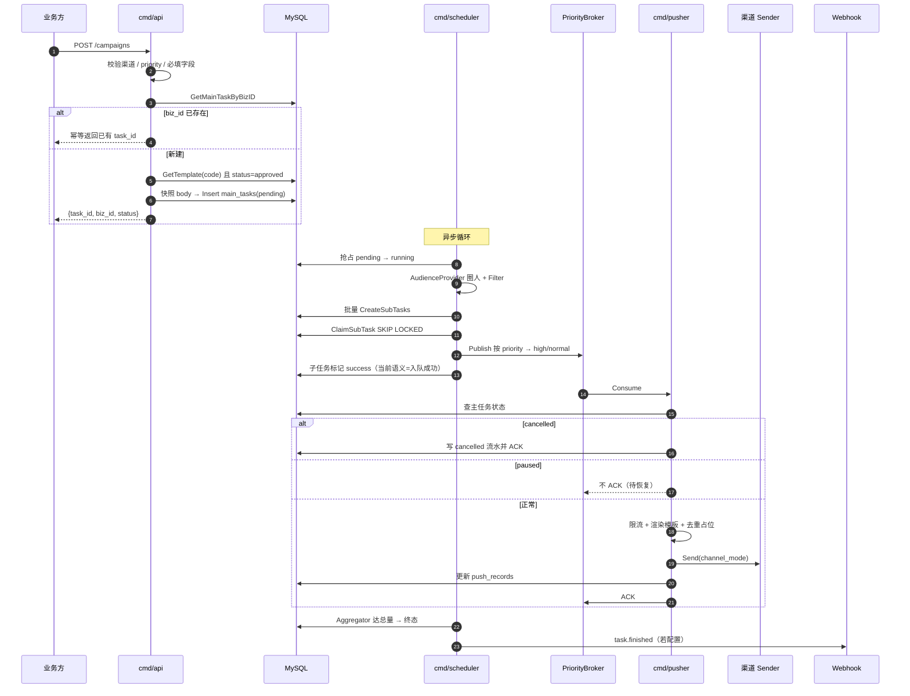

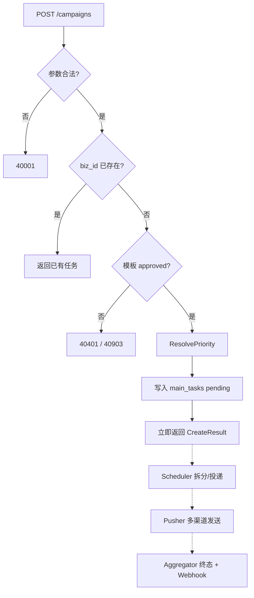

### 2. 查询进度 `GET /campaigns/:id` · `/progress` · `/biz/:biz_id`

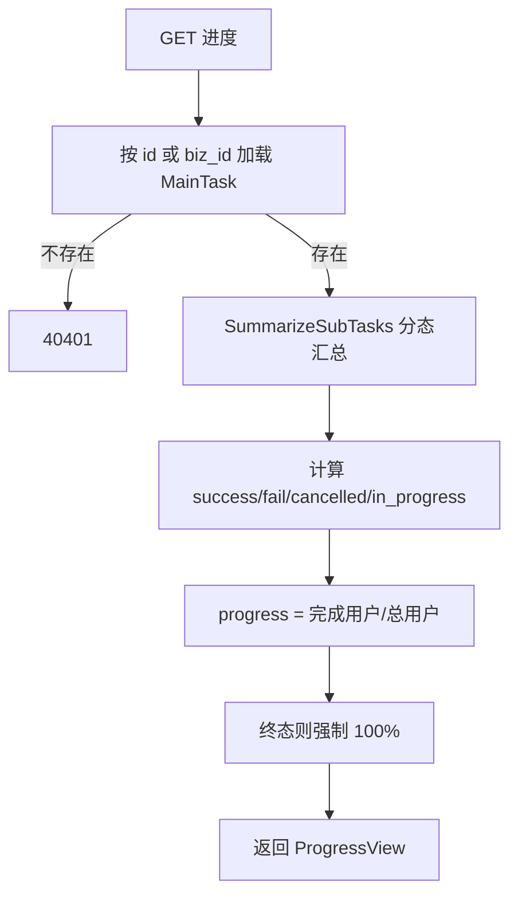

说明：当前 `success_users` 口径是 Scheduler「入队成功」，不是渠道送达数；渠道结果看 `push_records`。

### 3. 取消任务 `POST /campaigns/:id/cancel`

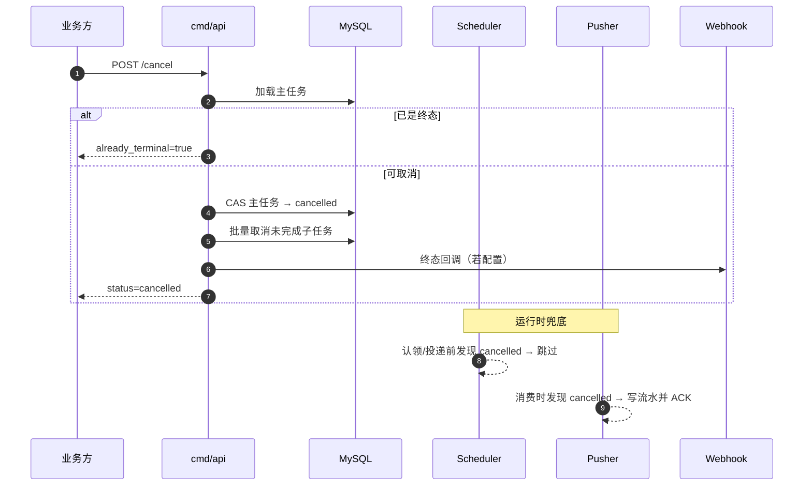

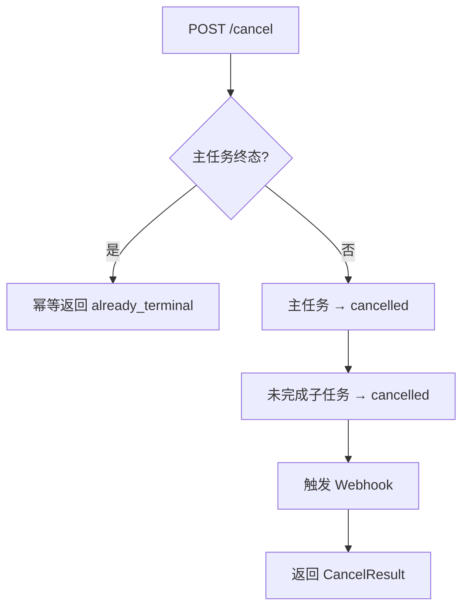

### 4. 暂停 / 恢复 `POST .../pause` · `POST .../resume`

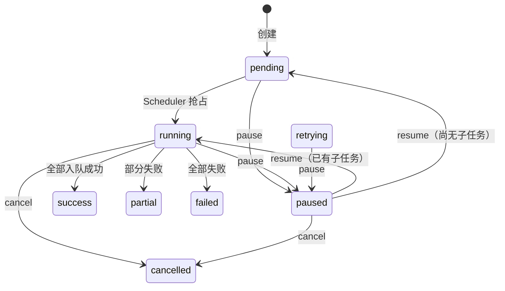

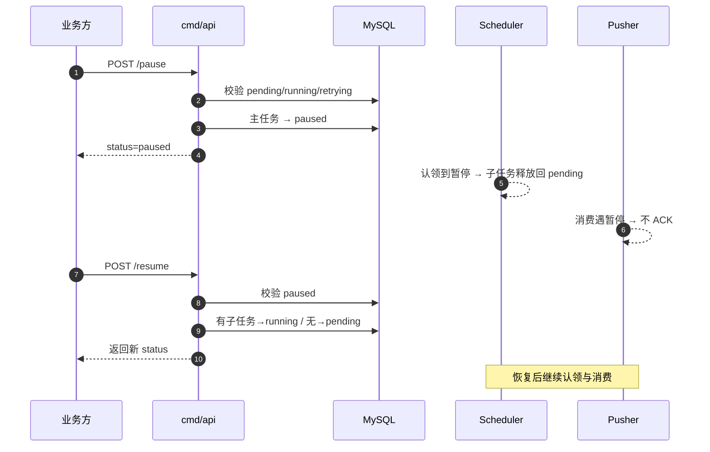

### 5. 失败重推 `POST /campaigns/:id/retry`

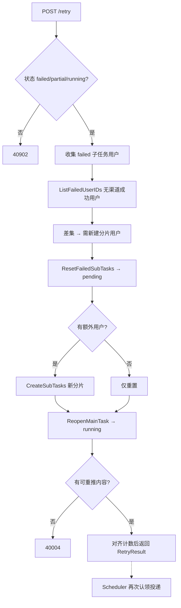

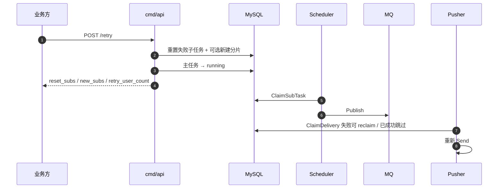

### 6. 模板审核流（创建 → 可用）

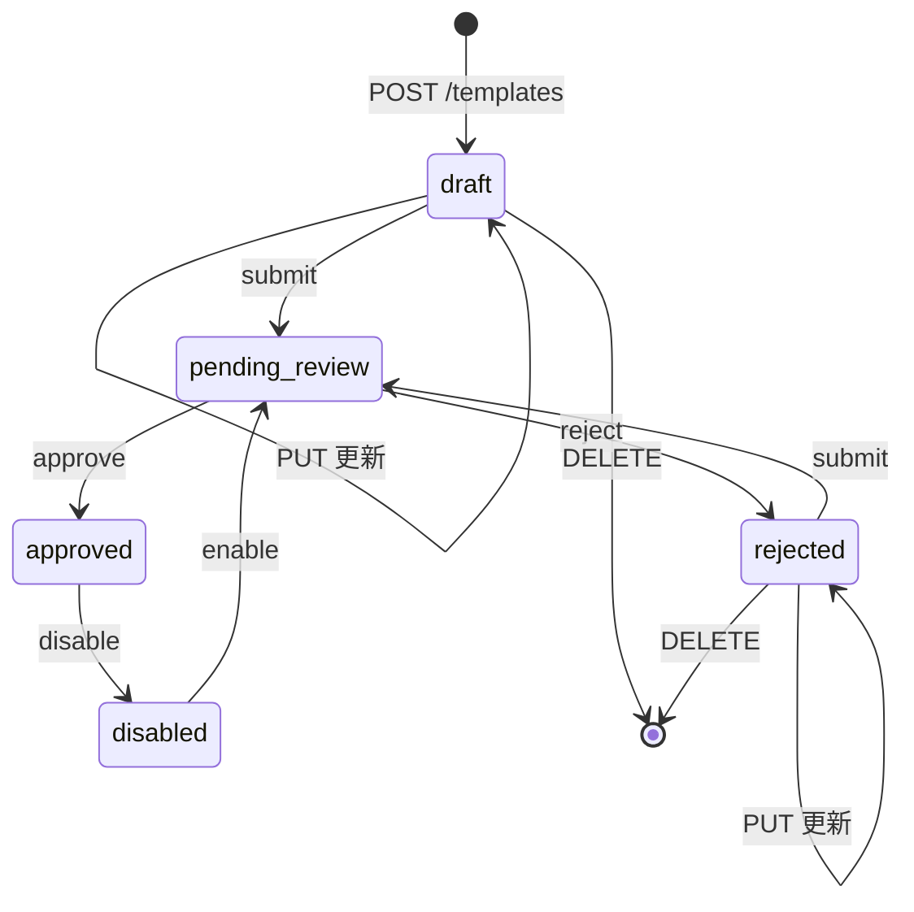

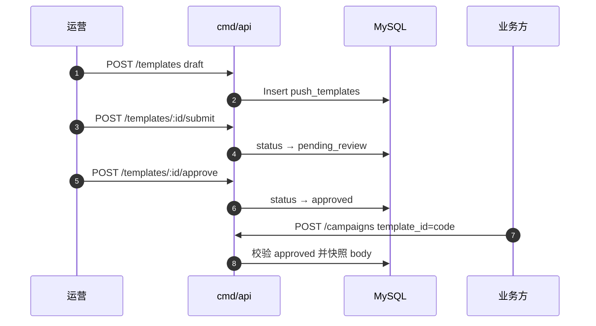

### 7. 渠道回执 `POST /callbacks/receipt`

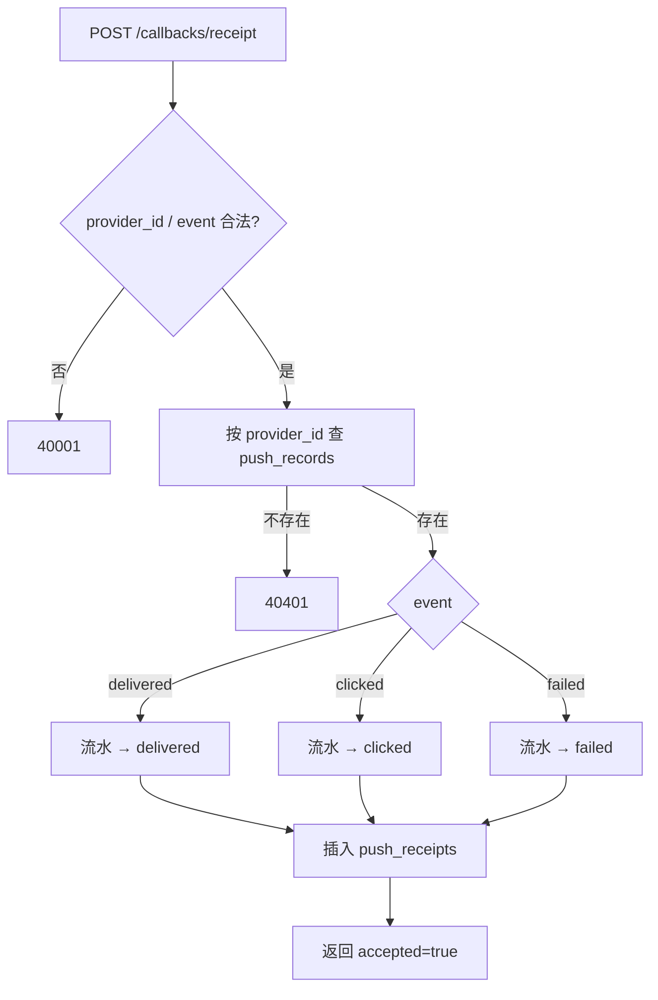

说明：回执**不**直接改主任务进度；主任务终态仍由 Scheduler Aggregator 驱动。

### 8. 主任务状态与接口关系总览

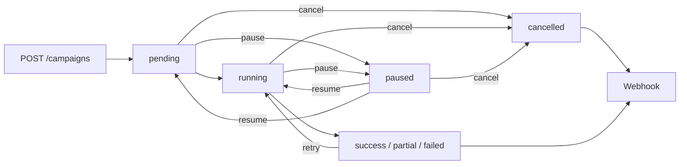

## 数据模型

`main_tasks` — 主任务（一次活动）

| 列 | 说明 |
| --- | --- |
| `id` | 主键 |
| `biz_id` | 唯一索引，业务幂等键 |
| `biz_scene` | 索引 |
| `priority` | `high` / `normal`，索引 |
| `title` | 活动标题 |
| `channel` | 主渠道（`channels[0]`），索引 |
| `channels` | JSON 有序渠道链 |
| `channel_mode` | `single` / `fallback` / `parallel` |
| `template_id` | 模板 `code` |
| `template_body` | 创建时的模板内容快照，后续改模板不影响已有活动 |
| `audience_ref` / `audience_extra` | 人群引用与扩展参数（JSON） |
| `payload` | JSON，仅存储 |
| `total_count` / `success_count` / `fail_count` | 用户维度计数 |
| `sub_task_total` / `sub_task_done` | 子任务计数 |
| `status` | 见状态机，索引 |
| `version` | 乐观锁版本号 |
| `webhook_url` | 覆盖默认终态回调 |
| `scheduled_at` / `started_at` / `finished_at` | 时间点 |

`sub_tasks` — 子任务（按用户分片）

| 列 | 说明 |
| --- | --- |
| `main_task_id` | 索引 |
| `shard_index` | 分片号，重推追加时从 `MAX+1` 继续 |
| `user_ids` | `mediumtext`，JSON `{"user_ids":[...],"vars":{"uid":{"k":"v"}}}` |
| `total_count` / `success_count` / `fail_count` | 用户计数 |
| `status` | 索引 |
| `retry_count` | 重推次数 |
| `worker_id` / `claimed_at` | 认领者与认领时间，配合 `claim_timeout_sec` 做超时接管 |
| `last_error` | 最近错误 |

`push_records` — 推送流水

| 列 | 说明 |
| --- | --- |
| `main_task_id` + `user_id` + `channel` | 联合唯一索引 `uk_task_user_channel`，是投递去重的最终保证 |
| `content` | 渲染后的正文 |
| `status` | `queued` / `sending` / `sent` / `delivered` / `clicked` / `failed` / `cancelled` |
| `provider_id` | 渠道侧消息 ID，索引，回执按此匹配 |
| `error_msg` / `sent_at` | 错误与发送时间 |

`push_receipts` — 渠道回执，记录 `push_record_id`、`main_task_id`、`sub_task_id`、`user_id`、`channel`、`event`、`raw_payload`。

`push_templates` — 模板中心，`code` 唯一索引，`status` 索引，含 `reject_reason`、`reviewed_by`、`reviewed_at`。

`AutoMigrate` 之前还会执行一条原始 `DELETE`，清理 `(main_task_id, user_id, channel)` 维度的历史重复流水（保留 `MAX(id)`），以便建立唯一索引；该语句的错误被显式忽略。

## MQ 消息与 Redis 键

Stream 中每条 entry 只有一个字段 `payload`，值是 `PushMessage` 的 JSON：

```json
{
  "msg_id": "1-3-u_new_users_1",
  "main_task_id": 1,
  "sub_task_id": 3,
  "user_id": "u_new_users_1",
  "channel": "inbox",
  "channels": ["inbox"],
  "channel_mode": "single",
  "template_id": "tpl_welcome",
  "body": "你好 {{name}}，你的积分是 {{score}}",
  "vars": {"name": "User1", "score": "1"},
  "biz_scene": "marketing",
  "priority": "normal",
  "created_at": "2026-01-01T00:00:00Z"
}
```

`msg_id` 由 `<main_task_id>-<sub_task_id>-<user_id>` 拼接，可用于排查；实际幂等依赖 `push_records` 唯一键与 Redis 去重标记，不依赖 `msg_id`。

Redis 键一览：

| 键 | 类型 | 说明 |
| --- | --- | --- |
| `starlink:push:high` / `starlink:push:normal` | Stream | 推送队列，Consumer Group 分别为 `pushers-high` / `pushers-normal` |
| `starlink:task:<main_task_id>:stats` | Hash | 字段 `success` / `fail` / `done`，TTL 7 天，用于子任务完成聚合 |
| `starlink:dedup:<main_task_id>:<user_id>:<channel>` | String | 成功投递标记，TTL `pusher.dedup_ttl_sec` |
| `starlink:freq:<key>` | String | 频控计数器（`freq.enabled` 后 Gateway 调用） |
| `starlink:quota:*` | Hash/String | 渠道配额令牌桶 / 自适应系数（`channel_quota`） |

## 状态与数据语义

主任务状态：

```text
pending → running ⇄ paused
              ├─→ success
              ├─→ partial
              ├─→ failed ──retry──→ running
              └─→ cancelled
```

`scheduled_at` 未到时任务保持 `pending`。取消会将尚未完成的子任务批量设为 `cancelled`；已成功进入 MQ 的消息仍可能存在，Pusher 消费时会再次检查主任务状态并跳过渠道调用。

`retrying` 状态在枚举、`IsPausable`、`ClaimSubTask` 条件里都出现，但代码没有任何地方把主任务或子任务写成 `retrying`——它目前是一个未使用的状态值。

必须特别注意当前统计口径（P1 已落地）：

- **流水线终态**：Scheduler 在一批消息成功写入 MQ 后把子任务标 `success`；主任务 `success`/`partial`/`failed` 仍按这些入队结果聚合（Redis 子任务 done 计数）。
- **用户成功/失败**：进度接口与主任务 `success_count`/`fail_count`（Webhook 展示）以 `push_records` 为准——任一渠道 `sent`/`delivered`/`clicked` 算成功用户；有失败流水且无成功渠道算失败用户。聚合终态、回执、重推校准会回写该计数。
- 因此主任务可能已是流水线 `success`，但渠道仍在发送或后续失败；失败用户可通过活动重推 API（仅 `failed`/`partial`）补发，并会清 Redis dedup。

若要把**主任务状态本身**改为「全部渠道送达才 success」，需另开需求把完成聚合点移到 Pusher/回执侧。

## 当前语义与已知限制

按上线风险排序。

### 一、消息可靠性

1. **~~MQ 失败消息不会自动再消费~~（已修复，`redis_stream`）。** `RedisStream.Consume` 每轮先 `XAUTOCLAIM` 认领空闲 PEL，再 `XREADGROUP >` 读新消息。handler 失败不 ACK，空闲超过 `mq.redis_stream.claim_min_idle_ms` 后可被任意 consumer 重投；投递次数达到 `max_delivery` 则写入死信 Stream（`topic` + `dlq_suffix`，默认 `:dlq`）并 ACK。主任务暂停（`domain.ErrMainTaskPaused`）只留 PEL、**不进 DLQ**，恢复后可继续消费。配置见 `mq.redis_stream`。**仍存缺口：** `memory` / `rocketmq` 驱动未实现同等 PEL/DLQ 语义。
2. **~~Stream 无清理策略~~（已修复，`redis_stream`）。** 写入走 `XADD MAXLEN ~`（`maxlen` / `dlq_maxlen` / `maxlen_approx`）；消费循环按 `trim_interval_sec` 定期 `XTRIM`；ACK 成功后可选 `XDEL`（`ack_xdel`，默认 true）释放已确认条目。显式 `-1` 可关闭对应上限或定期裁剪。**注意：** Redis 裁剪不感知 Consumer Group，`maxlen` 过小可能删掉仍在 PEL 中的消息，请按峰值积压留余量。
3. **~~Pusher 配置并发未真正生效~~（已修复）。** `RedisStream.Consume` / `MemoryQueue.Consume` 使用大小为 `batch`（即 `worker_concurrency` / `high_worker_concurrency`）的 worker 池：每条消息在独立 goroutine 中执行 handler，并在该 worker 内完成 ACK / PEL / DLQ。读循环与处理解耦，sem 提供背压。RocketMQ 侧仅做在途上限；若 transport 串行回调则吞吐仍取决于 SDK。
4. **~~优先级隔离不彻底~~（已缓解）。** `channel_quota.channels.*.high_reserve_ratio>0` 时 high/normal 分桶；仍建议生产用 `-queue=high`/`normal` 分进程隔离并发。

### 二、任务状态与计数正确性

5. **~~任务完成口径早于真实发送~~（口径已拆分）。** 流水线终态仍按入队；用户成功/失败与进度按 `push_records`；回执/终态后 `SyncMainUserCounts`。主任务状态本身尚未改为「渠道全部成功」。
6. **~~子任务超时重认领存在重复完成竞态~~（已修复）。** `UpdateSubTaskResult` 要求 `worker_id` 匹配且状态为 `running|retrying`，丢认领时 `updated=false`，调用方不再 `OnSubFinished`。聚合侧 `TryMarkSubFinished`（Redis SET `starlink:task:{id}:sub_finished`）按子任务幂等；`SetSubDone` 重推对齐时清空该集合，允许失败子任务再次计入。
7. **~~CAS 冲突会丢计数~~（已修复）。** 计数走无锁 `success_count/fail_count/sub_task_done` 原子递增；仅终态切换 CAS `version`。冲突重试时增量置 0，只重试状态迁移。
8. **~~拆分任务缺少租约恢复~~（已修复）。** 抢占 `pending→running` 时写入 `split_owner` / `split_lease_at`；`Splitter` 分页圈人时续约；拆分结束清理租约。`loopSplit` 每轮扫描 `running && sub_task_total=0 && 无子任务行 && 租约过期` 的卡单，经 `ClaimStaleSplitMainTask` 抢占后重入拆分。配置：`scheduler.split_lease_sec`（默认 90）。已有子任务的任务不会重拆，避免重复分片。
9. **~~暂停与拆分存在状态覆盖竞态~~（已修复）。** `PatchMainMeta` 只写 `total_count`/`sub_task_total`，不写 `status`，并排除 `paused`/`cancelled`/终态。
10. **~~`PatchMainMeta` 不在接口里~~（已修复）。** 已收口 `TaskRepository.PatchMainMeta`；`Splitter` 直接调用。
11. **~~重推路径有若干不严谨处~~（已修复）。** 仅 `failed`/`partial` 可重推；`ReopenMainTask` 不再接受 `running`；兜底同步保留 `fail_count`；`RetryResult.Status` 读库；重推前 `ClearDelivered`。
12. **~~进度用户数是启发式推算~~（已修复）。** 有 `push_records` 时以 `CountUserOutcomes` 为准；无流水时回退子任务汇总（不再用 `UserTotal` 顶替 0 成功/失败）。
13. **唯一键导致重推无法覆盖“已发送但实际失败”的用户。** `push_records` 的 `(main_task_id, user_id, channel)` 唯一键使得同一活动对同一用户同一渠道只会成功投递一次。若渠道返回成功但业务侧确认失败，`ClaimDelivery` 会判定 `duplicate` 并跳过，重推无效。跨活动重发需要新建活动。失败重推已清 Redis dedup，但仍受流水唯一键与 `DeliveredOK` 占位约束。

### 三、回执与流水

14. **~~回执不是幂等状态机~~（已修复）。** `CanTransitTo` 单向前进；过期事件忽略；同 `(push_record_id, event)` 不重复插入回执。
15. **~~回执会覆盖 `sent_at`~~（已修复）。** 仅首次进入 `sent` 且 `sent_at` 为空时写入。
16. **~~回执会清空 `error_msg`~~（已修复）。** 失败回执可写入 `raw_payload` 截断为原因；非失败且无新文案时保留原错误；成功发送路径才清空。
17. **~~回执把所有错误都当成 404~~（已修复）。** 仅 `ErrRecordNotFound` → 404，其它错误原样返回。

### 四、功能缺口

18. **~~外部集成均为演示实现~~（可配置接通）。** Demo 人群仅支持 `audience.demo_scenes`（默认 `demo`/`dev`）；`audience.http` 可接真实圈人。渠道默认 stub，`pusher.channels.*.mode=http` 可接厂商网关；`wecom`/`dingtalk` 已注册（stub，可改 http）。
19. **~~没有频控~~（已接通）。** `freq.enabled` 后 Gateway 调 `Allow`；`quiet_hours` 免打扰留 PEL。默认 `enabled: false`。
20. **~~部分字段尚未接通~~（已接通）。** Title/Payload → SendRequest；`default_channel` 创建回填；Splitter 求交 `TargetUser.Channels`；`send_windows`/`pace_qps`/`ab_sample_percent` 可用。
21. **~~未使用的代码~~（已清理）。** 已删除 `CreateRecords` / `CountSubTasksByStatus` / `MergeVars` / `Sanitize`；空人群返回 `errcode.AudienceEmpty`；`ClearDelivered` 已在重推路径使用。
22. **~~模板并发创建会撞唯一键~~（已修复）。** 空 code 用 `tmp_{uuid}` 占位再改 `tpl_{id}`；更新/审核走 `version` CAS。

### 五、性能与扩展性

23. **~~每条消息多次查库~~（已缓解）。** Gateway 对主任务状态做 300ms 短缓存；渠道令牌等待后强刷一次；doSend 仅在重试 backoff 后刷新。仍非分布式缓存。
24. **~~拆分是单协程串行的~~（已修复）。** `split_concurrency` 控制同实例并行拆分数（默认 2）。
25. **~~拆分把整个人群缓存在内存里~~（已修复）。** 分页流式 `CreateSubTasks`；拆分租约未清前不 Claim；卡单重拆先删半成品再全量重拆。
26. **~~限流是进程内的~~（已升级）。** `channel_quota.enabled=true` 时按渠道×优先级令牌桶（`distributed: true` 走 Redis）；超时返回 `ErrChannelThrottled` 留 PEL。Scheduler 高压反压 `pace`；`admission: enforce` 可拒创；HTTP 429 自适应缩 QPS。`enabled=false` 仍回退 `rate_limit_qps` 进程内全局桶。

### 六、安全与可观测性

27. **安全能力部分缺失。** 运营台已有配置账号 + Session Cookie 登录门禁（租户/RBAC/改密 UI 仍待办）。渠道回执接口仍公开、无签名校验。`webhook_url` 由调用方任意提供且无白名单，存在 SSRF 风险；Webhook 本身也没有签名、重试或持久化 outbox。`response.Fail` 会把内部错误文本返回给客户端。
28. **启动迁移风险。** API、Scheduler、Pusher 都会执行 `AutoMigrate`，三个进程可能并发执行 DDL；迁移前的历史重复流水清理错误还被 `_ =` 忽略。生产应由单独的迁移任务执行。
29. **健康检查过浅。** `/healthz` 不检查依赖，没有 readiness、Prometheus 指标、链路追踪、结构化审计或告警。
30. **~~测试为空~~（已有基础单测）。** 覆盖状态机、渠道求交、NormalizeChannels、ResolvePriority、RenderTemplate、MQ PEL/DLQ、聚合幂等；集成/E2E 仍待扩。

### 七、工程细节

31. **~~`gofmt` 未通过~~（已整理）。** 关键热点文件已 `gofmt -w`；建议 CI 加门禁。
32. **~~`go.mod` 依赖分类不准~~（已修复）。** `go-sql-driver/mysql` 已升为直接依赖。
33. **部分字符串/错误判定。** `EnsureReady` 用 `BUSYGROUP` 子串判断组已存在（封装 `isBusyGroup`）。暂停/时窗/免打扰用 sentinel + `errors.Is`。
34. **~~`sendParallel` 忽略限流错误~~（已修复）。** 尊重 `waitToken` 的 cancel/deadline。
35. **~~Compose 服务耦合镜像构建顺序~~（已修复）。** 三服务均自带 `build`，不再依赖 api 先起。

## 运维与排查

业务日志统一带等级前缀，便于过滤：

```bash
make logs
# 或
docker compose logs -f api scheduler pusher

# 只看错误 / 警告
docker compose logs api scheduler pusher 2>&1 | grep '\[ERROR\]'
docker compose logs api scheduler pusher 2>&1 | grep -E '\[ERROR\]|\[WARN\]'
```

`text` 格式示例：`2026-08-05 18:55:53 [INFO] mq ready driver=redis_stream ...`  
也可在配置里设 `log.format: json`，按 `"level":"ERROR"` 过滤。等级由 `log.level` 控制（`debug`/`info`/`warn`/`error`）。

查看队列积压、PEL 与死信：

```bash
redis-cli XLEN starlink:push:normal
redis-cli XINFO GROUPS starlink:push:normal
redis-cli XPENDING starlink:push:normal pushers-normal

# 查看具体 pending（idle / delivery count）
redis-cli XPENDING starlink:push:normal pushers-normal - + 10

# 死信队列（达到 max_delivery 后写入；字段含 payload/source_id/error/dead_at）
redis-cli XLEN starlink:push:normal:dlq
redis-cli XRANGE starlink:push:normal:dlq - + COUNT 10
redis-cli XLEN starlink:push:high:dlq

# 容量：主队列应在 maxlen 附近波动；ack_xdel=true 时已消费条目会被删除，XLEN 主要反映未 ACK 积压
redis-cli XLEN starlink:push:normal
```

`pending` 短暂上升后应随 `claim_min_idle_ms` 被 `XAUTOCLAIM` 消化。若持续增长：检查 Pusher 是否存活、`claim_min_idle_ms` 是否过大、或 handler 是否在 `max_delivery` 内反复失败（失败会进 DLQ）。暂停中的消息会一直留在 PEL 直到恢复，属预期行为。若 `XLEN` 长期顶满 `maxlen` 且业务仍有积压，应扩容消费或调高 `maxlen`（过小裁剪可能影响 PEL）。

仅在确认可丢弃时手工 ACK（会永久丢弃、不会进 DLQ）：

```bash
redis-cli XACK starlink:push:normal pushers-normal <entry-id>
```

查看聚合计数与去重标记：

```bash
redis-cli HGETALL starlink:task:1:stats
redis-cli SMEMBERS starlink:task:1:sub_finished   # 已计入完成的子任务 ID
redis-cli KEYS 'starlink:dedup:1:*'   # 生产请用 SCAN 代替 KEYS
```

排查一个用户为什么没收到：

```sql
SELECT status, provider_id, error_msg, sent_at
FROM push_records
WHERE main_task_id = 1 AND user_id = 'u_new_users_1';

SELECT event, created_at FROM push_receipts
WHERE main_task_id = 1 AND user_id = 'u_new_users_1' ORDER BY id;
```

排查卡住的任务：

```sql
-- 拆分卡单：running 且无子任务（租约过期后会被 Scheduler 自动回收重拆）
SELECT id, biz_id, status, split_owner, split_lease_at, started_at FROM main_tasks
WHERE status = 'running' AND sub_task_total = 0;

-- 被认领但长时间未完成的子任务
SELECT id, main_task_id, worker_id, claimed_at FROM sub_tasks
WHERE status = 'running' AND claimed_at < NOW() - INTERVAL 5 MINUTE;
```

## 二次开发

### 接入真实人群

1. 实现 HTTP 圈人服务：`POST audience.http.url`，请求体为 `AudienceQuery`，响应 `AudiencePage`（含可选 `Channels`）。
2. 配置：

```yaml
audience:
  demo_enabled: false   # 生产建议关闭
  http:
    enabled: true
    url: "https://your-audience/resolve"
    scenes: [marketing, payment]  # 空=承接所有场景
```

3. 或实现 `port.AudienceProvider` 后在 `bootstrap` 中 **先于 Demo** `Register`。Demo 仅匹配 `demo_scenes`，不会再兜底吃掉业务 `biz_scene`。

黑名单 / 退订：向 Redis SET `starlink:blacklist`、`starlink:unsub:{channel}` 写入 `user_id` 即可被 Filter 剔除。

### 接入真实渠道：三方推送

内置 `app_push` / `sms` / `email` / `inbox` / `wecom` / `dingtalk` 默认 **Stub**。接入真实供应商：

```yaml
pusher:
  channels:
    sms:
      mode: http
      url: "https://your-sms-gateway/send"
      timeout_sec: 5
```

HTTP 网关接收 `SendRequest` JSON（含 `title`/`content`/`vars`/`extra`），返回 `SendResult`（`success`/`provider_id`/`retryable`）。亦可用 `channel.Register` 覆盖为 SDK 实现。

#### 不用改什么

| 模块 | 说明 |
| --- | --- |
| `cmd/api` 创建活动 / 进度 / 取消等 | 仍传 `channel` / `channels` / `channel_mode` |
| `internal/scheduler` | 只负责投递 MQ，不感知渠道 SDK |
| `internal/push/gateway.go` | 已按注册表 `Get(channel)` 调用，支持 single/fallback/parallel |
| MQ / 去重 / 优先级队列 | 与渠道厂商无关 |

#### 场景 A：替换已有渠道（例如把 stub `sms` 换成真实短信）

改动面最小，渠道名仍用 `sms` / `app_push` / `email` / `inbox`。

| 步骤 | 改哪里 | 做什么 |
| --- | --- | --- |
| 1 | 新建 `internal/adapter/channel/sms_aliyun.go`（示例名） | 实现 `port.ChannelSender`：`Channel()` 返回 `domain.ChannelSMS`，`Send` 调厂商 SDK |
| 2 | `internal/bootstrap/bootstrap.go` | `RegisterDefaults` 之后（或替换其中一项）`chReg.Register(NewAliyunSMS(cfg))`；若要去掉 stub，不要再 `Register(NewSMS())`，或在 Defaults 里注释掉 |
| 3 | `configs/config.yaml`（建议） | 增加厂商配置：AccessKey、签名、模板码、endpoint 等，并在 `config.Config` 增加对应结构 |
| 4 | （可选）回执 | 厂商回调打到已有 `POST /api/v1/callbacks/receipt`，`provider_id` 必须与 `Send` 返回的 `ProviderID` 一致；生产应加签名校验 |

`Send` 约定：

```go
type ChannelSender interface {
    Channel() domain.ChannelType
    Send(ctx context.Context, req domain.SendRequest) (*domain.SendResult, error)
}
```

| 入参 / 出参 | 说明 |
| --- | --- |
| `req.MsgID` | 平台侧消息 ID（含 task/sub/user/channel），可用于幂等 |
| `req.UserID` | 目标用户；真实渠道通常还要自己查手机号 / device_token（可用 Extra 或外部服务） |
| `req.Content` | 已渲染正文 |
| `req.Vars` | 模板变量（若厂商要模板参数可再映射） |
| `result.Success` | 是否受理成功 |
| `result.ProviderID` | **必须**填厂商消息 ID，回执靠它反查流水 |
| `result.Retryable` | `true` 时 Gateway 会按 `pusher.max_retry` 重试；鉴权错误、号码非法等应 `false` |
| `error` | 传输层异常；业务失败也可 `Success=false` + `ErrorMsg` |

最小实现骨架：

```go
package channel

type AliyunSMS struct{ /* client, sign, ... */ }

func (s *AliyunSMS) Channel() domain.ChannelType { return domain.ChannelSMS }

func (s *AliyunSMS) Send(ctx context.Context, req domain.SendRequest) (*domain.SendResult, error) {
    // 1. 尊重 ctx；设 HTTP/SDK 超时
    // 2. UserID → 手机号（自查）
    // 3. 调厂商 API
    // 4. 映射错误：可重试 → Retryable=true
    return &domain.SendResult{
        Success:    true,
        ProviderID: "aliyun-biz-msg-id", // 回执必须能对上
    }, nil
}
```

bootstrap 注册示例：

```go
chReg := channel.NewRegistry()
channel.RegisterDefaults(chReg)          // 若要替换 stub，可去掉对应 NewSMS()
chReg.Register(channel.NewAliyunSMS(cfg)) // 同 Channel() 再 Register 会覆盖 stub
```

#### 场景 B：新增一种渠道类型（例如 `wechat` / `voip`）

在场景 A 之外，还要让创建活动校验认识新名字：

| 步骤 | 改哪里 | 做什么 |
| --- | --- | --- |
| 1 | `internal/domain/status.go` | 增加常量，如 `ChannelWechat ChannelType = "wechat"`，并写入 `Valid()` |
| 2 | 新建 Sender 实现 | `Channel()` 返回新常量 |
| 3 | `bootstrap` | `chReg.Register(...)` |
| 4 | 配置 / 密钥 | 同场景 A |
| 5 | 文档与联调 | 创建活动 `channels` 可写 `"wechat"`；`GET /api/v1/channels` 应能列出 |

创建活动示例：

```json
{
  "biz_id": "mkt-wx-001",
  "biz_scene": "marketing",
  "channels": ["wechat", "sms"],
  "channel_mode": "fallback",
  "template_id": "tpl_xxx",
  "audience_ref": "...",
  "audience_extra": {"total": 100}
}
```

#### 回执怎么接

```text
厂商回调 → 你们的网关（验签、解析）→ POST /api/v1/callbacks/receipt
  body: { "provider_id": "<Send 时返回的 ID>", "event": "delivered|clicked|failed", "raw_payload": "..." }
```

| 注意 | 说明 |
| --- | --- |
| `provider_id` | 必须与流水里存的一致，否则 `40401` |
| 幂等 / 状态机 | 当前回执接口较薄（可重复写、可回退状态），生产建议在回调网关做去重后再转发 |
| 鉴权 | 现网应对 `/callbacks/receipt` 加鉴权或仅内网可达 |

#### 常见坑

1. **只换 SDK 忘了覆盖注册**：`RegisterDefaults` 仍注册 stub，后注册同 `Channel()` 会覆盖；若先真实后 Defaults，会被 stub 盖掉——注意注册顺序。
2. **`ProviderID` 为空**：后续无法用回执更新送达/点击。
3. **需要 Title / Payload**：Gateway 当前只填 `MsgID/UserID/Channel/Content/Vars`；若厂商要标题或扩展字段，需把 `MainTask.Title` / `Payload` 透传到 `PushMessage` 再写入 `SendRequest`（改 `scheduler/worker.go` 组装消息 + `gateway.sendOne` 填 `SendRequest`）。
4. **用户标识映射**：平台只有 `UserID`，手机号 / push token 要在 Sender 内查或通过人群 `Vars`/`Extra` 带入。
5. **限流**：配置 `channel_quota`；厂商 429 会 `Throttled` 并收缩有效 QPS。Sender 仍应正确返回 `Retryable`。

#### 改动清单速查

```text
必改（替换已有渠道）
  ├─ internal/adapter/channel/<vendor>_<channel>.go   # ChannelSender 实现
  ├─ internal/bootstrap/bootstrap.go                  # Register，覆盖 stub
  └─ configs/config.yaml + internal/config/config.go  # 密钥与 endpoint（建议）

新增渠道名时额外
  └─ internal/domain/status.go                        # ChannelType 常量 + Valid()

可选
  ├─ 厂商回调网关 → POST /api/v1/callbacks/receipt
  ├─ scheduler/worker.go + push/gateway.go            # 透传 Title/Payload/Extra
  └─ README / 监控指标（按渠道成功率、耗时）
```

联调：创建活动指定该渠道 → 看 Pusher 日志 / `push_records.provider_id` →（有回执）打 `/callbacks/receipt` → 查 `push_receipts`。

### 切换 / 扩展 MQ 驱动

MQ 为可插拔设计：业务只依赖 `port.MessageQueue` / `port.PriorityBroker`，通过 `mq.Register` + `mq.Open` 按配置装配。

| 驱动 | `mq.driver` | 说明 |
| --- | --- | --- |
| Redis Stream | `redis_stream`（默认） | 现有实现，依赖 `redis.*` 配置 |
| RocketMQ | `rocketmq` | `go build -tags rocketmq` + 配置 `name_servers`；bootstrap 自动注入 Apache Transport |
| Memory | `memory` | 进程内 channel，适合单测 / 无中间件本地联调 |
| 自定义 | 任意名 | `mq.Register("kafka", factory)` 后配置 `driver: kafka` |

**换 RocketMQ 步骤：**

1. `go get github.com/apache/rocketmq-client-go/v2`
2. `go build -tags rocketmq ./cmd/scheduler ./cmd/pusher`（或 `./...`）
3. 配置：

```yaml
mq:
  driver: rocketmq
  high:
    topic: starlink-push-high
    group: pushers-high
  normal:
    topic: starlink-push-normal
    group: pushers-normal
  rocketmq:
    name_servers: ["127.0.0.1:9876"]
    # access_key / secret_key / namespace 按云厂商需要填写
    retry: 2
```

说明见 `internal/adapter/mq/rocketmq_transport_example.go`。亦可自行 `mq.SetRocketTransport(...)` 注入其它实现。

**自定义 Kafka 等驱动：**

```go
func init() {
    mq.Register("kafka", func(deps mq.Deps) (*mq.Queues, error) {
        // 返回 High / Normal 两个 port.MessageQueue 实现
        return &mq.Queues{High: highQ, Normal: normalQ}, nil
    })
}
```

队列名统一用 `topic`（Redis 下等同 Stream 名）；旧字段 `stream` 仍兼容。

### 建议的修复顺序

1. ~~Redis Stream PEL 重投（`XAUTOCLAIM`）、最大尝试次数、死信队列~~（已完成）。~~`MAXLEN` / `XTRIM` / ACK 后 `XDEL`~~（已完成）。~~Pusher 真并发~~（已完成）。
2. ~~把限流改成分布式、按队列隔离~~（已完成：`channel_quota`）。
3. ~~定义活动成功口径…~~（已完成，见 P1）。
4. ~~给拆分加 lease…~~（已完成）。
5. ~~P2 产品 SPI 接通（人群/渠道/频控/字段/模板/RocketMQ）~~（已完成）。
6. 补单元测试、MySQL/Redis 集成测试和端到端测试；回执补签名校验。
7. 再接入认证授权、Webhook 签名与 outbox、Prometheus 指标、追踪和独立迁移工具。

## 开发与检查

```bash
gofmt -l .
go vet ./...
go build ./...
go test ./...
```

当前状态：`go vet` / `go build` / 基础 `go test ./internal/...` 通过。建议继续覆盖：

- 集成：`ClaimSubTask` 竞态、`ClaimDelivery`、Gateway 三模式；
- 端到端：memory MQ + demo audience 创建到终态；
- Redis Stream pending 恢复（真实 Redis + 失败 handler）。

## 目录结构

```text
cmd/                    三个可执行程序（api / scheduler / pusher）
configs/                本地与 Docker 配置
web/                    前端运营台（Vite + React；独立 Dockerfile，Compose 端口 3000）
internal/app/           活动、模板、回执应用服务
internal/domain/        领域模型、状态机与 API 输入
internal/port/          可替换接口（SPI 与仓储）
internal/adapter/       MySQL、Redis、可插拔 MQ、人群、渠道、Webhook 适配器
  mq/                   redis_stream / rocketmq / memory + Register/Open 工厂
internal/scheduler/     人群拆分、子任务 Worker、状态聚合
internal/push/          消费者、推送网关、模板渲染
internal/handler/       Gin Handler
internal/server/        路由
internal/bootstrap/     依赖装配
pkg/                    通用错误码与 HTTP 响应
scripts/                容器入口脚本
```

## License

仓库当前未包含 LICENSE 文件。对外发布或复用前，请明确许可证并补充对应文件。
