# Starlink 推送运营台 · 用户使用手册

> 适用版本：当前 `main` 分支运营台（Web `http://localhost:3000` / API `/api/v1`）  
> 截图日期：2026-08-10  
> 读者：运营人员、管理员、只读访客（viewer）

本文按「登录 → 日常投放 → 人群与合规 → 模板与通知 → 权限配置」的顺序说明界面操作。文中截图均来自本地实测环境，界面文案以实际页面为准。

---

## 目录

1. [快速入门](#1-快速入门)
2. [界面总览](#2-界面总览)
3. [运营概览](#3-运营概览)
4. [任务管理](#4-任务管理)
5. [创建活动](#5-创建活动)
6. [进度与分析](#6-进度与分析)
7. [模板中心](#7-模板中心)
8. [通知管理](#8-通知管理)
9. [人群资产](#9-人群资产)
10. [黑名单 / 退订](#10-黑名单--退订)
11. [用户偏好中心](#11-用户偏好中心)
12. [审计日志](#12-审计日志)
13. [角色 / 权限 / 用户](#13-角色--权限--用户)
14. [常见问题](#14-常见问题)
15. [附录：内置账号与权限](#15-附录内置账号与权限)

---

## 1. 快速入门

### 1.1 访问地址

| 环境 | 地址 |
|------|------|
| 运营台 | `http://localhost:3000`（或部署后的域名） |
| API 健康检查 | `http://localhost:8080/healthz` |

本地可用 `make up` / `make rebuild` 启动全栈（Web、API、Scheduler、Pusher、MySQL、Redis）。

### 1.2 登录

打开运营台后进入登录页：

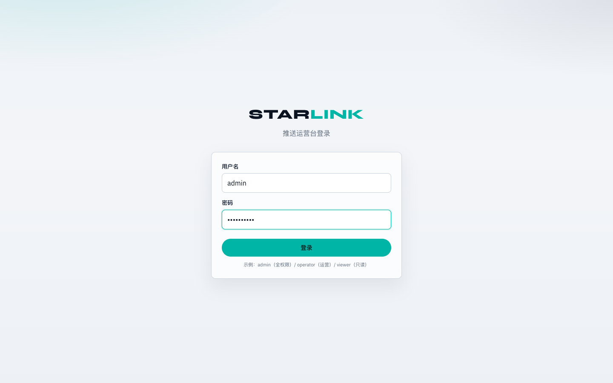

1. 输入**用户名**与**密码**
2. 点击 **登录**
3. 成功后进入「运营概览」

页面底部提示了三类示例角色：

| 角色 | 典型用途 |
|------|----------|
| `admin` | 全权限：投放、人群、偏好、审计、用户与权限配置 |
| `operator` | 日常运营：活动 / 模板 / 通知 / 人群 / 偏好（无审计与系统配置） |
| `viewer` | 只读：可看菜单与列表，不能写操作 |

> **安全提示**：生产环境务必修改默认密码；密码存储为 bcrypt 哈希，后台「查看密码」仅显示运营侧备注口令（若有），不是哈希原文。

### 1.3 推荐上手路径（5 分钟）

1. 登录 → 看一眼**运营概览**的近 24h 发送数据  
2. **模板中心**确认有一条「已审核」模板（如 `tpl_1`）  
3. **创建活动**：选模板、填人群引用、选站内信 → **创建并开始拆分**  
4. 在**任务管理**或**通知中心**点「进度」查看执行情况  
5. （可选）到**人群资产 / 黑名单 / 用户偏好**熟悉合规能力  

---

## 2. 界面总览

登录后左侧为深色导航栏，右侧为工作区。菜单是否出现取决于当前账号的权限码（按钮级权限同样生效）。

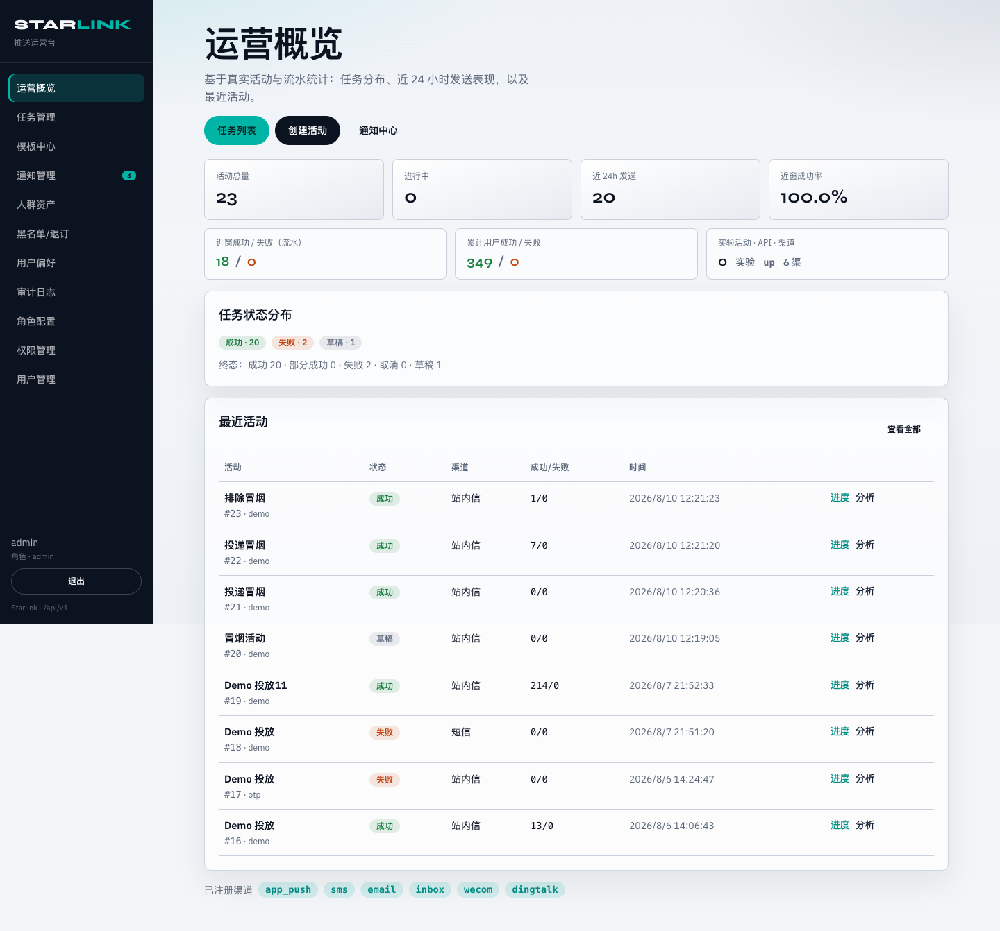

### 2.1 菜单说明

| 菜单 | 用途 |
|------|------|
| 运营概览 | 全局 KPI、任务分布、最近活动入口 |
| 任务管理 | 活动列表、筛选、复制、暂停/恢复/取消、创建入口 |
| 模板中心 | 多渠道模板的创建、审批、启用/停用 |
| 通知管理 | 任务完成/失败等运营通知，支持 SSE 实时刷新 |
| 人群资产 | 可复用人群段（投放目标 / 排除名单） |
| 黑名单/退订 | 运营侧抑制名单（全渠道黑名单、按渠道退订） |
| 用户偏好 | 用户侧订阅偏好与同意变更审计 |
| 审计日志 | 后台写操作留痕（查询本身不记审计） |
| 角色配置 / 权限管理 / 用户管理 | RBAC 三件套（通常仅 admin） |

底部显示当前用户名、角色，以及 **退出** 按钮。

### 2.2 通用交互约定

- **筛选区**：同一行的下拉框、输入框与「查询」按钮底部对齐；支持回车触发查询。  
- **弹窗**：新建 / 编辑 / 重置密码等多用模态框，`Esc` 或「取消」关闭。  
- **权限**：无权限的按钮会隐藏或不出现；直接调 API 也会返回 403。  
- **分页**：列表底部显示「第 X / Y 页 · 共 N 条」。  

---

## 3. 运营概览

路径：左侧 **运营概览**，或登录后默认首页。


### 3.1 你能看到什么

- **活动总量 / 进行中 / 近 24h 发送 / 近窗成功率** 等卡片  
- **任务状态分布**：成功、失败、草稿等终态计数  
- **最近活动**表格：活动名、状态、渠道、成功/失败、时间  
- 每行可点 **进度**、**分析**  
- 页底 **已注册渠道**（如 `inbox` / `sms` / `email` / `app_push` / `wecom` / `dingtalk`）

### 3.2 快捷按钮

| 按钮 | 作用 |
|------|------|
| 任务列表 | 跳转任务管理 |
| 创建活动 | 跳转创建活动页 |
| 通知中心 | 跳转通知管理 |

---

## 4. 任务管理

路径：**任务管理**

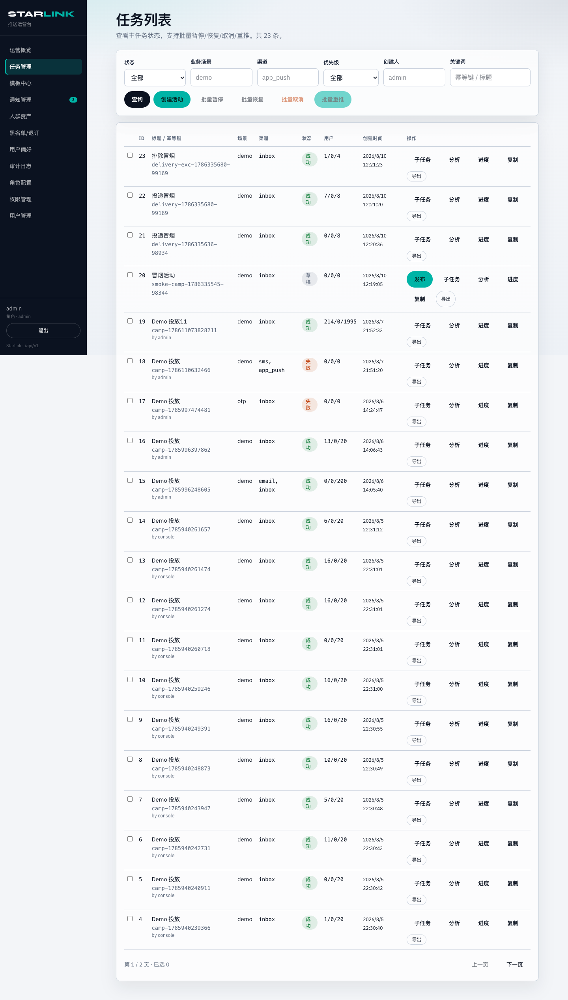

### 4.1 筛选与查询

常见筛选项包括：业务场景、状态、关键词、时间范围等（以页面实际字段为准）。  
填写后点 **查询**；输入框支持防抖，避免每个按键都打接口。

### 4.2 列表字段（常见）

- 活动标题 / 业务 ID / 任务 ID  
- 状态（草稿、待执行、运行中、成功、失败、取消等）  
- 渠道、优先级、创建时间  

### 4.3 常用操作

| 操作 | 说明 |
|------|------|
| 创建活动 | 与筛选同一行的入口按钮，进入创建页 |
| 进度 | 查看拆分/投递进度 |
| 分析 | 查看活动指标与实验相关数据 |
| 复制 | 基于已有活动快速创建 |
| 暂停 / 恢复 / 取消 | 控制运行中任务（需对应权限） |
| 失败重推 | 对失败用户再次投递（需权限） |

> 按钮是否可见由权限码控制，例如 `campaign.create`、`campaign.pause`、`campaign.cancel` 等。

---

## 5. 创建活动

路径：**创建活动**（概览快捷按钮 / 任务管理入口 / 直接访问 `/campaigns`）

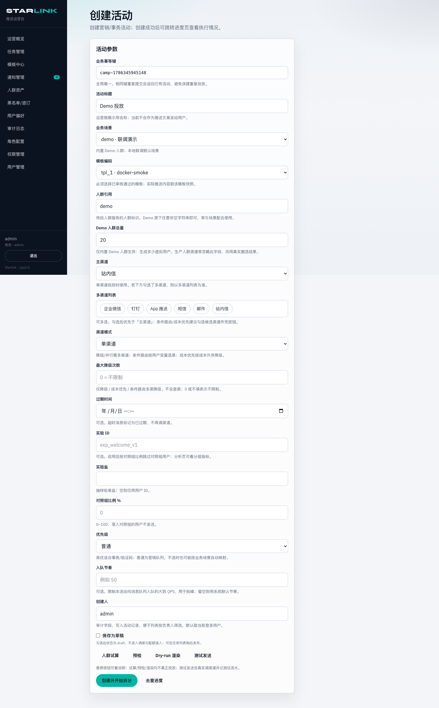

### 5.1 必填与核心字段

| 字段 | 说明 |
|------|------|
| 业务幂等键 | 全局唯一。同一业务键重复提交不会重复开活动 |
| 活动标题 | 运营台展示用 |
| 业务场景 | 如 `demo`、`marketing`、`txn` 等；会影响默认优先级与免打扰策略 |
| 模板编码 | 必须选择**已审核通过**的模板 |
| 人群引用 | 交给人群 Provider 的 `audience_ref`（演示环境常用 `demo` / `demo:all`） |
| Demo 人群总量 | 演示 Provider 用，用于生成虚拟用户数量 |
| 主渠道 / 多渠道 | 多选后以多渠道列表为准 |
| 渠道模式 | 单渠道 / 降级 / 并行 / 全成功 / 条件路由 / 成本优先 |
| 优先级 | `普通`（营销）/ `高`（事务，验证码等） |
| 入队节奏 | 可选 QPS 上限，限制拆分入队速度 |
| 保存为草稿 | 勾选后只落草稿，不立刻拆分 |

### 5.2 实验相关（可选）

- **实验 ID**：写入流水与实验看板  
- **对照组比例 %**：落入对照组的用户不发送，用于对照  

### 5.3 创建前辅助能力

页面底部提供四个「试算」类按钮（带 tips 说明用途）：

| 按钮 | 用途 |
|------|------|
| 人群试算 | 估算本次圈人规模，避免活动过大误发 |
| 预检 | 检查模板、渠道、配额等是否满足发布条件 |
| Dry-run 渲染 | 对指定用户做模板渲染预览，不真实下发 |
| 测试发送 | 向测试用户真实发一条，验证渠道与内容 |

### 5.4 提交

- **创建并开始拆分**：创建后进入调度拆分 → 推送流水线  
- **去查询进度**：跳到进度页观察执行  

### 5.5 与人群资产 / 合规的关系

- 创建页支持两种人群来源：**手工填写 audience_ref**，或 **引用人群段**（含静态 CSV 导入的手机号/邮箱名单）。  
- **人群段、排除名单、黑名单、用户偏好** 在各自菜单维护；发送链路会自动做退订 / 偏好终检。  
- 选静态人群后，请将主渠道设为 **短信** 或 **邮件**；号码/邮箱经 Extra 透传到渠道 Sender。

---

## 6. 进度与分析

### 6.1 进度页

从任务列表、概览或通知中心进入 **进度**。

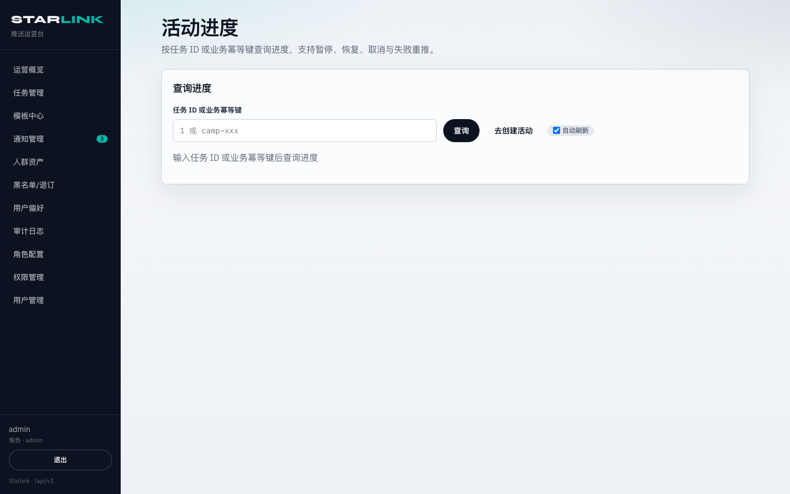

可查看：

- 主任务状态、进度百分比  
- 子任务拆分与完成情况  
- 暂停 / 恢复 / 取消等操作（有权限时）  
- 支持自动刷新；任务结束后停止轮询  

### 6.2 运营分析 / 流水

部分入口会进入运营页（`/ops/:id`），用于查看发送流水、导出等：

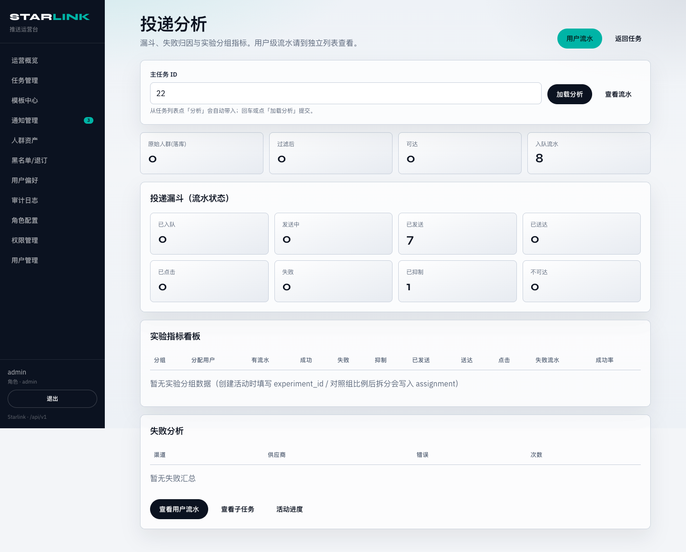

常见能力：

- 按状态查看发送流水  
- 导出 CSV（大批量走异步导出任务）  
- 失败重推入口  

---

## 7. 模板中心

路径：**模板中心**

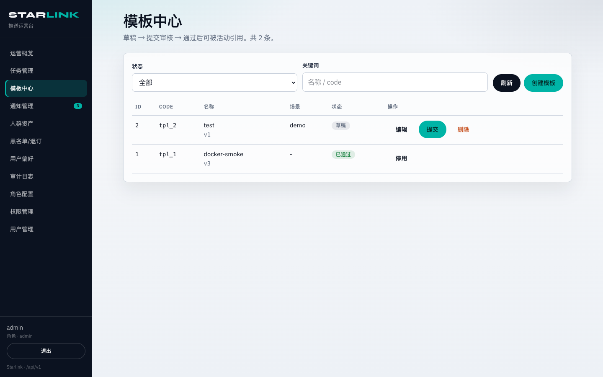

### 7.1 列表

- 按关键词筛选模板  
- 查看状态：草稿 / 待审 / 已通过 / 已停用等  
- 支持编辑、提交审批、启用/停用、回滚等（依权限）

### 7.2 新建 / 编辑模板

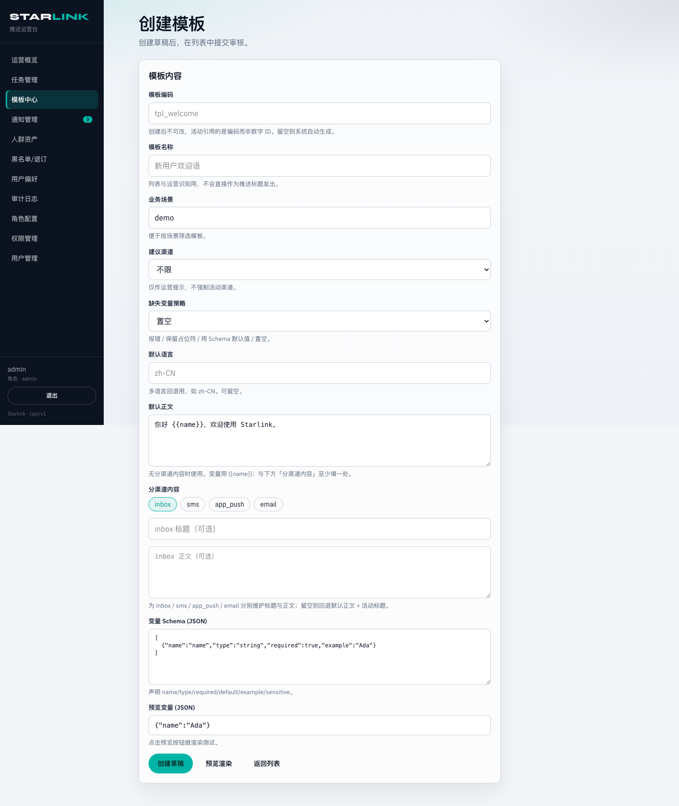

要点：

1. 填写模板编码、名称、正文变量 schema  
2. 为各渠道配置标题 / 正文 / 扩展字段  
3. 短信等强监管渠道可配置厂商模板号（若字段已开放）  
4. 保存为草稿 → 提交审批 → 审批通过后方可被活动引用  

> 创建活动时若模板不可用，接口会拒绝创建。请先保证至少有一条「已审核」模板。

---

## 8. 通知管理

路径：**通知管理**

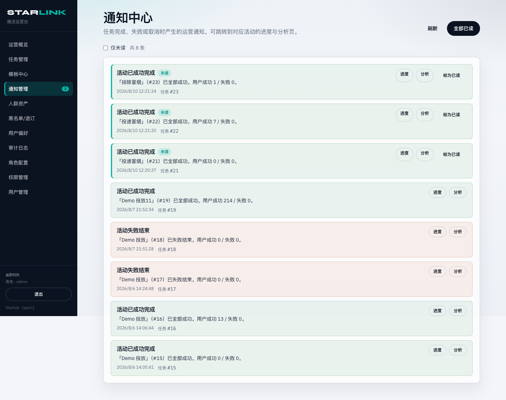

### 8.1 作用

当活动**成功完成 / 失败 / 取消**等时，系统写入运营通知。页面通过 **SSE** 实时刷新未读角标与列表，无需手工刷页面。

### 8.2 操作

| 操作 | 说明 |
|------|------|
| 仅未读 | 过滤未读通知 |
| 标为已读 | 单条已读 |
| 全部已读 | 清空未读角标 |
| 进度 / 分析 | 跳到对应活动 |

左侧菜单「通知管理」旁的数字角标 = 未读条数。

---

## 9. 人群资产

路径：**人群资产**

把一次性圈人参数沉淀成可复用资产：活动可直接引用 code，成员数用快照缓存，减少每次预检都重新圈人。

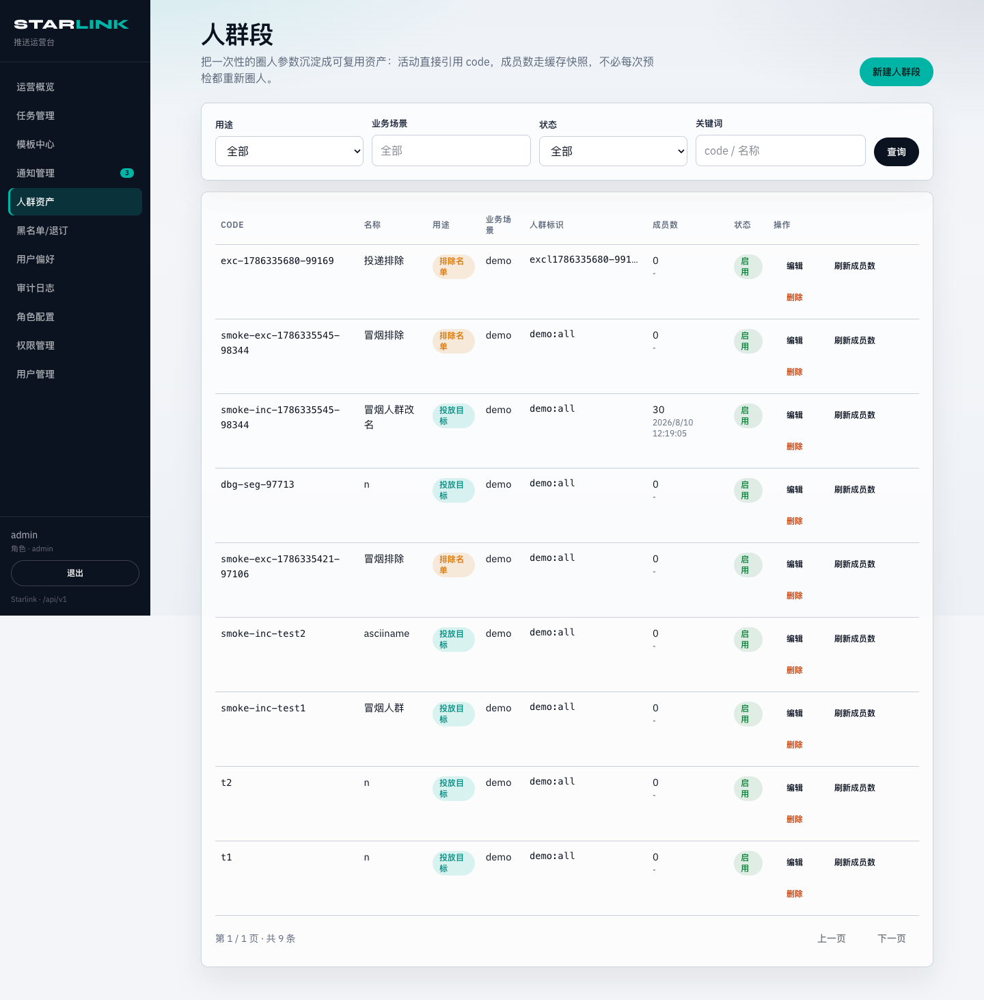

### 9.1 列表与筛选

| 筛选项 | 说明 |
|--------|------|
| 用途 | 投放目标（include）/ 排除名单（exclude） |
| 业务场景 | 如 `demo` |
| 状态 | 启用 / 停用 |
| 关键词 | 匹配 code 或名称 |

表格列：CODE、名称、用途、业务场景、人群标识、成员数（含最近统计时间）、状态、操作。

### 9.2 新建人群段

点击 **新建人群段**：

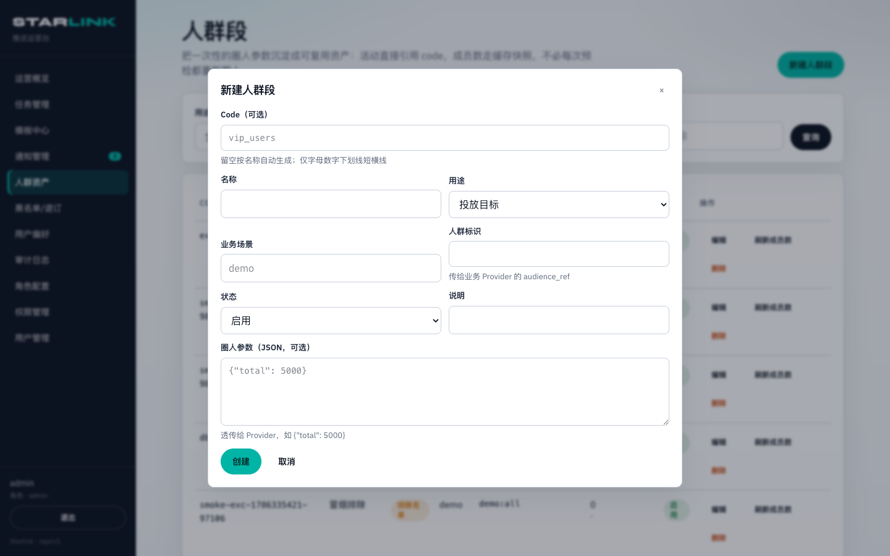

| 字段 | 是否必填 | 说明 |
|------|----------|------|
| Code | 否 | 留空则按名称自动生成；仅字母数字下划线连字符 |
| 名称 | 是 | 展示名 |
| 用途 | 是 | **投放目标** 或 **排除名单** |
| 来源 | 是 | **动态圈人**（Provider）或 **静态导入**（CSV 手机号/邮箱） |
| 业务场景 / 人群标识 | 动态必填 | 静态来源由系统锁定为 `static` / 段 code |
| 状态 | 是 | 启用 / 停用 |
| 说明 | 否 | 备注 |
| 圈人参数 (JSON) | 动态可选 | 透传 Provider，如 `{"total":5000}` |

点击 **创建** 保存。静态人群创建后会进入 **导入名单**：上传 CSV（表头 `phone` 或 `email`，可选 `user_id`），再在创建活动时引用该段并选短信/邮件渠道。

### 9.3 行内操作

| 操作 | 说明 |
|------|------|
| 编辑 | 弹窗修改（为全量更新语义：名称 / 场景 / 人群标识等需一并提交） |
| 导入名单 | 仅静态段：上传 CSV / 清空成员 |
| 刷新成员数 | 动态段翻页统计；静态段直接 COUNT 成员表 |
| 删除 | 若仍有活动引用该段，**禁止删除**并提示引用数量 |

### 9.4 投放目标 vs 排除名单

| 用途 | 含义 |
|------|------|
| 投放目标 | 正选人群，定义「发给谁」 |
| 排除名单 | 负选人群，拆分阶段从目标人群中剔除 |

> 排除名单停用或解析失败时，活动会**整单失败**而不是静默忽略，避免误发。

---

## 10. 黑名单 / 退订

路径：**黑名单/退订**

运营侧抑制名单：投递链路读 Redis 快路径，本页维护可审计的 DB 权威副本（先写库再同步缓存）。

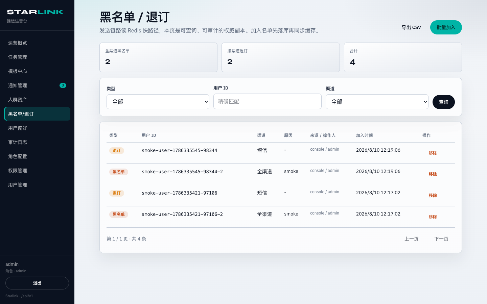

### 10.1 顶部统计

- 全渠道黑名单数量  
- 按渠道退订数量  
- 合计  

### 10.2 筛选

- 类型：全部 / 黑名单 / 退订  
- 用户 ID：精确匹配  
- 渠道：全部或具体渠道  

### 10.3 批量加入

点击 **批量加入**：

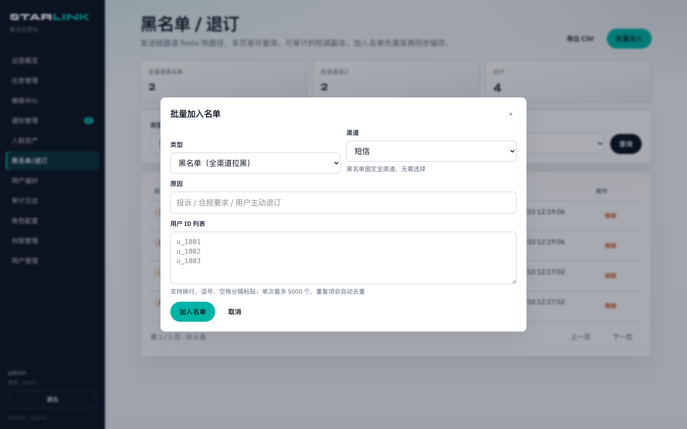

1. 选择类型：**黑名单**（全渠道）或 **退订**（必须选渠道）  
2. 在文本框粘贴用户 ID，每行一个  
3. 填写原因（可选）  
4. 提交  

行为约定：

- 重复导入幂等，返回真实新增条数  
- Redis 同步失败时，库中数据仍保留，错误信息会说明「已入库 N 条」  
- 黑名单的渠道固定为「全渠道」  

### 10.4 移除与导出

- 行内 **移除**：从库与 Redis 同步删除  
- **导出 CSV**：把当前筛选结果导出到本地  

### 10.5 与「用户偏好」的区别

| | 黑名单/退订 | 用户偏好 |
|--|-------------|----------|
| 决策方 | 运营 / 客服 | 用户本人意愿 |
| 典型场景 | 投诉、风险用户、渠道级硬退订 | 营销总开关、主题退订、免打扰 |
| 发送链路 | Redis 终检 | 偏好 Resolver 终检 |

两者都会拦截发送；排查时看流水 `error_msg` 可区分原因。

---

## 11. 用户偏好中心

路径：**用户偏好**

管理用户自己的选择：营销退订、渠道退订、主题退订、免打扰、期望送达时段。每次变更写入同意审计，便于合规举证。

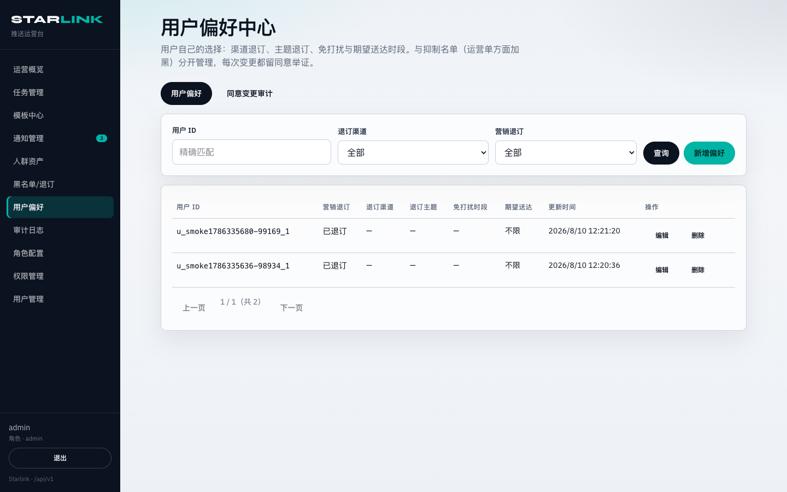

### 11.1 Tab：用户偏好

**筛选**：用户 ID、退订渠道、是否营销退订。  

**表格列**：用户 ID、营销退订、退订渠道、退订主题、免打扰时段、期望送达、更新时间、操作。

#### 新增 / 编辑偏好

点击 **新增偏好** 或行内 **编辑**：

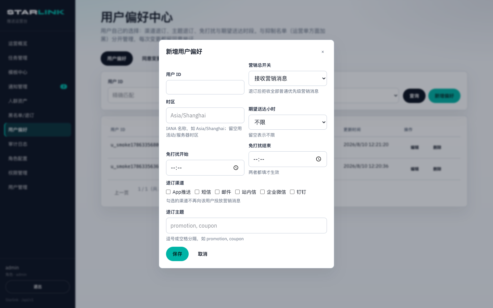

可配置：

| 项 | 说明 |
|----|------|
| 用户 ID | 新增时可手填；编辑时只读 |
| 营销总开关 | 打开后 normal 优先级营销消息全部拦截 |
| 退订渠道 | 如短信、邮件等 |
| 退订主题 | 如 `promotion`；活动未指定 topic 时可用业务场景兜底 |
| 时区 | IANA 名，如 `Asia/Shanghai` |
| 免打扰起止 | `HH:MM` 格式，如 `22:00`–`08:00` |
| 期望送达小时 | 0–23；清空用产品约定的哨兵值（界面若提供「不限」即可） |

校验失败示例：非法时区、`9:00`（缺前导零）、`preferred_hour=25`、非法渠道名 —— 接口会直接拒绝。

#### 删除偏好

行内 **删除** 会清除该用户偏好，并写入同意审计（含汇总 scope）。

### 11.2 Tab：同意变更审计


只读列表，记录：

- 动作：`opt_in` / `opt_out`  
- 范围：如 `marketing`、`channel:sms`、`topic:promotion`、`quiet_hours`  
- 详情：旧值 → 新值  
- 操作人与时间  

**差量写入**：只改营销开关时只产生 1 条；未变化的字段重复提交不会刷屏。

### 11.3 发送链路如何生效（运营须知）

1. 用户设置营销退订后，普通优先级活动对该用户写入 `suppressed`，`error_msg` 类似：  
   `user unsubscribed: user opted out of marketing`  
2. 高优先级（事务）消息**不受营销退订与用户免打扰约束**，避免验证码发不出去。  
3. 用户免打扰与平台全局免打扰取**并集**：用户只能更严，不能放宽平台策略。  

---

## 12. 审计日志

路径：**审计日志**（通常需 `audit.view`）

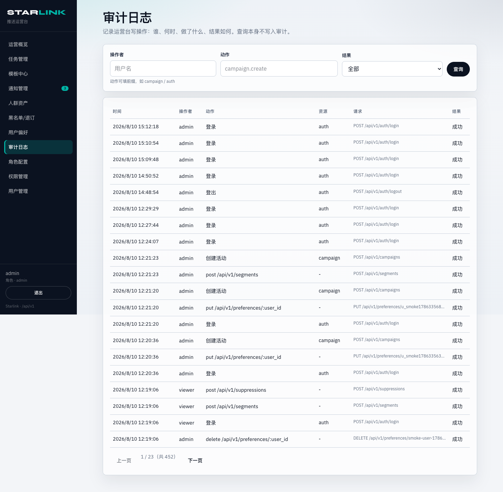

### 12.1 记录范围

- 记录后台**写操作**（登录、创建活动、改权限、加黑名单等）  
- **不记录**普通查询  
- **不记录**渠道回执回调（避免海量机器流量淹没审计）  

### 12.2 筛选

可按操作人、动作、成功与否、时间范围等过滤。筛选项与按钮同行对齐。

---

## 13. 角色 / 权限 / 用户

这三页组成权限系统（菜单 + 按钮级）。通常仅 **admin** 可见。

### 13.1 角色配置

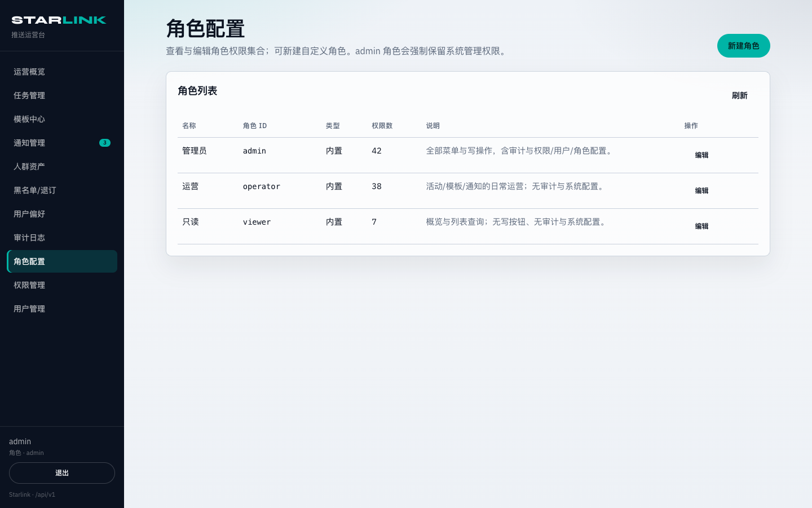

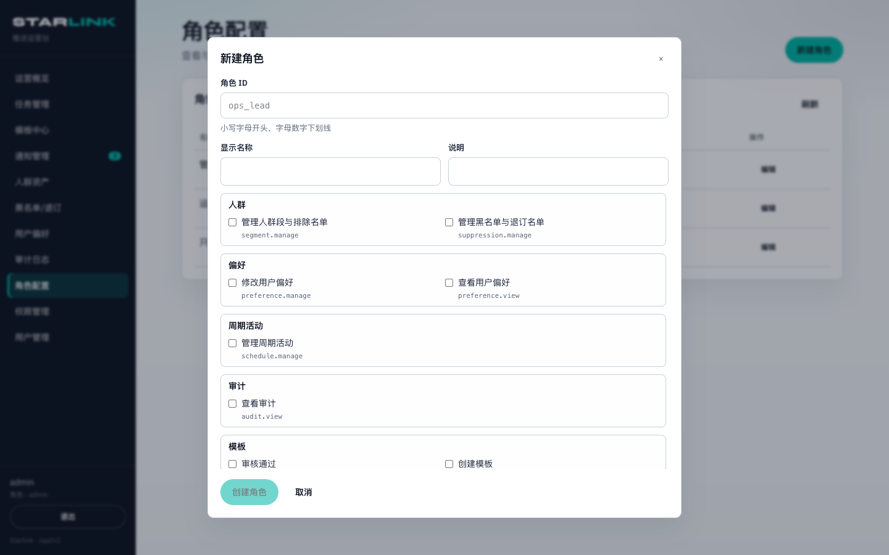

- 内置角色：`admin` / `operator` / `viewer`  
- 可自定义角色并勾选权限码  
- 系统角色的描述与是否系统角色受保护  

### 13.2 权限管理

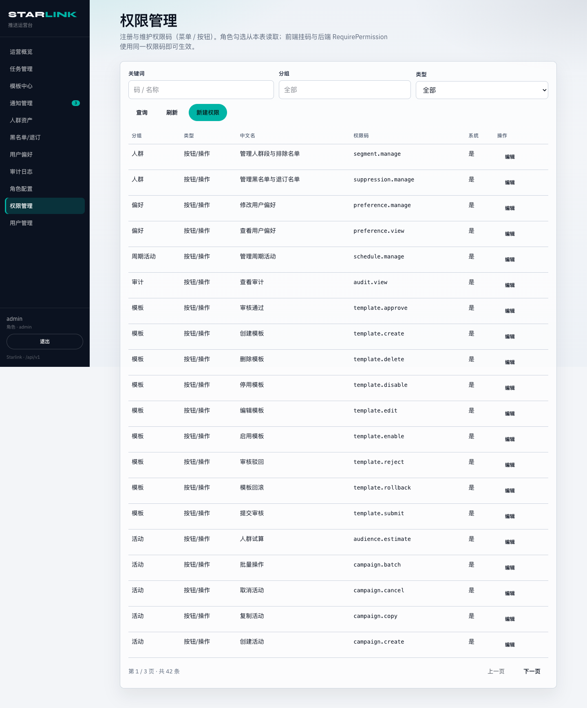

- 权限码分页列表（`menu.*` 菜单、`campaign.*` 等动作）  
- 支持新建自定义权限码、编辑中文名/分组  
- 新版本升级时，内置权限码会自动补齐并授予系统角色；**自定义角色不会被自动扩权**

### 13.3 用户管理

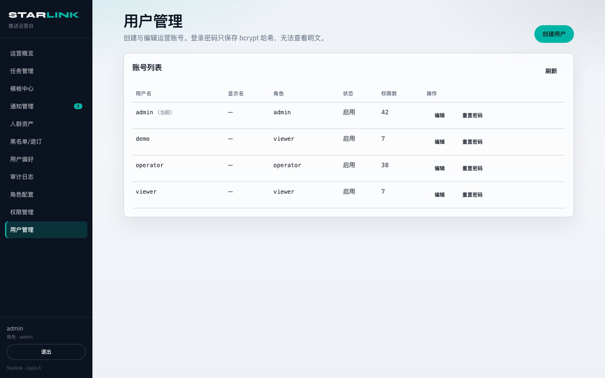

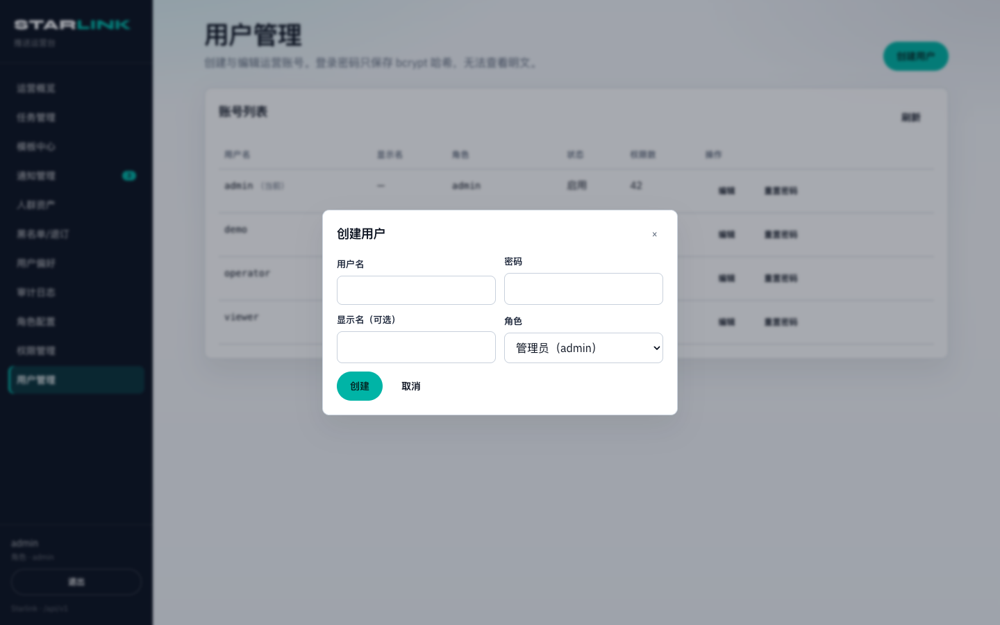

| 能力 | 说明 |
|------|------|
| 创建用户 | 用户名、密码、角色、显示名 |
| 编辑 | 改角色、启用/停用等 |
| 重置密码 | 弹窗重置 |
| 查看密码 | 行内或弹窗展示备注口令（若维护了 password_note） |

---

## 14. 常见问题

### Q1. 登录提示 403？

常见原因：

1. 浏览器跨域 / 反代 `Host` 头丢端口 → 确认 Nginx 使用 `$http_host`  
2. 账号密码错误或用户被停用  
3. 会话 cookie 未带上（需同站或正确 CORS）  

### Q2. 创建活动失败「模板不可用」？

模板必须为已审核可用状态。到模板中心检查状态并完成审批。

### Q3. 为什么有的用户状态是 suppressed？

依次排查：

1. **黑名单/退订** 是否命中  
2. **用户偏好** 是否营销退订 / 渠道退订 / 主题退订  
3. 频控或全局营销上限是否触达  
4. 看流水 `error_msg` 的具体原因文案  

### Q4. 排除名单生效了吗？

拆分阶段生效：目标人群 6 人、排除 2 人时，应只产生 4 条发送流水，被排除用户**不会出现**任何流水。若排除段停用或超限，活动会失败而不是少剔几个人。

### Q5. viewer 看不到「用户偏好」菜单？

内置 viewer 默认只有部分菜单（含人群资产只读），不含偏好读写。需要的话由管理员在角色里勾选 `menu.preferences` / `preference.view`。

### Q6. 升级后新菜单有了但按钮 403？

请重启 API 以触发权限同步（`syncBuiltinPermissions`）。系统角色会自动获得新增内置权限；自定义角色需管理员手动勾选。

---

## 15. 附录：内置账号与权限

### 15.1 本地演示账号（以配置 / 库表为准）

| 用户名 | 角色 | 说明 |
|--------|------|------|
| admin | admin | 全权限 |
| operator | operator | 日常运营 |
| viewer | viewer | 只读 |

密码以部署配置或管理员重置结果为准；切勿把生产密码写进文档仓库。

### 15.2 与本手册相关的权限码（节选）

| 权限码 | 含义 |
|--------|------|
| `menu.segments` | 菜单·人群资产 |
| `segment.manage` | 人群段写操作 |
| `suppression.manage` | 黑名单/退订写操作 |
| `menu.preferences` | 菜单·用户偏好 |
| `preference.view` / `preference.manage` | 偏好读 / 写 |
| `campaign.create` 等 | 活动相关写操作 |
| `rbac.manage` | 角色/权限/用户配置 |
| `audit.view` | 审计日志 |

### 15.3 相关冒烟脚本（给实施同学）

仓库内可重复执行：

```bash
./scripts/smoke_segments_preferences.sh   # 人群 + 偏好 API 冒烟
./scripts/smoke_delivery_optout.sh        # 真实投递链路：偏好拦截 + 排除名单
```

---

## 修订记录

| 日期 | 说明 |
|------|------|
| 2026-08-10 | 首版：覆盖登录、概览、任务、创建活动、模板、通知、人群资产、黑名单、用户偏好、审计与 RBAC；配真实界面截图 |

如需补充「周期活动 / 渠道 SLA 看板」等后续功能章节，等对应前端页面上线后再追加即可。
