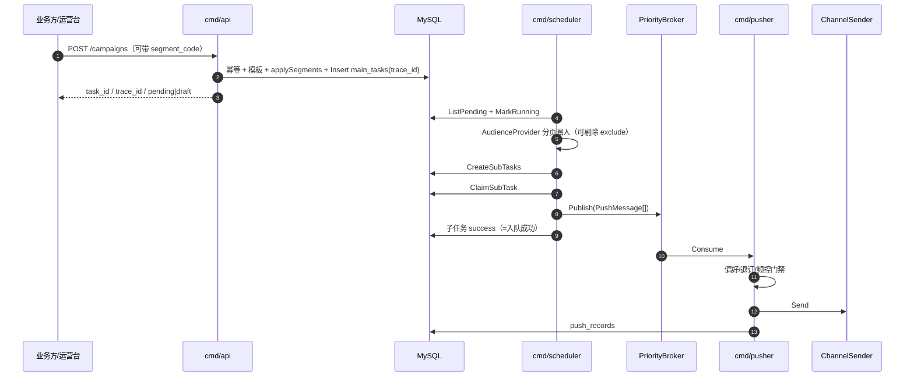

# 创建活动主流程（代码阅读指南）

> 文档状态：2026-08-11 修订（补 draft/ops、`segment_code`、`trace_id`、扩展渠道策略与偏好门禁）

本文说明一次「创建推送活动」从 HTTP 入口到渠道发送的完整链路，并标出建议按顺序阅读的源码位置。

> **关键语义**：`POST /api/v1/campaigns` **默认只负责落库主任务并立刻返回**；圈人、拆分子任务、写 MQ、渠道发送均由 `scheduler` / `pusher` **异步**完成。勾选 `as_draft` 时落 `draft`，需再 `POST .../publish` 才进入调度。

相关能力速览：

| 能力 | 入口 |
|------|------|
| 创建前预检 / Dry-run / 人群试算 | `POST /campaigns/preflight`、`/campaigns/dry-run`、`/audiences/estimate`（`campaign/ops.go`） |
| 引用人群段 / 静态 CSV | `segment_code` / `exclude_segment_code`；见代码阅读_05、手册 §9.5 |
| 活动级追踪 | 落库 `trace_id`（`tr_*`）；响应头 `X-Trace-Id`；运营台「全链路追踪」 |
| 鉴权 | Session Cookie + 权限码（回执与 health 放行） |

---

## 1. 总览

```text
业务方 / 运营台
  │  （可选）preflight / estimate / dry-run
  │  POST /api/v1/campaigns   （或 draft → publish）
  ▼
┌─ 同步（cmd/api）─────────────────────────────────────────────┐
│  Auth → Handler → applySegments → Create → MySQL main_tasks   │
│  返回 { task_id, biz_id, trace_id, status: pending|draft }    │
└──────────────────────────────────────────────────────────────┘
  │
  ▼
┌─ 异步 Scheduler ─────────────────────────────────────────────┐
│  loopSplit：pending → running，圈人（含排除段），写 sub_tasks   │
│  loopClaim：认领 → Publish MQ；写 trace_events（拆分节点）      │
│  Aggregator：终态 + Webhook                                   │
└──────────────────────────────────────────────────────────────┘
  │
  ▼
┌─ 异步 Pusher ────────────────────────────────────────────────┐
│  Consume → 偏好/退订终检 → 渲染 → 限流 → ResolveSendChannels  │
│  single|fallback|parallel|all_success|conditional|cost_priority│
│  写 push_records；异常写 trace_events                         │
└──────────────────────────────────────────────────────────────┘
```



---

## 1.1 创建前 Ops（不落主任务）

| API | 作用 | 代码 |
|-----|------|------|
| `POST /audiences/estimate` | 试算圈人规模与样本 | `ops.go` Estimate |
| `POST /campaigns/preflight` | 模板/容量/人群风险预检 | Preflight |
| `POST /campaigns/dry-run` | 渲染预览；`send=true` 可测发 | DryRun |

运营台创建页底部按钮即调用以上接口。详见用户手册 §5.3。

---

## 2. 阶段 A：HTTP 同步创建（建议先读）

### 2.1 路由入口

| 文件 | 说明 |
|------|------|
| [`internal/server/router.go`](../internal/server/router.go) | `POST /api/v1/campaigns` → `Campaign.Create` |
| [`cmd/api/main.go`](../cmd/api/main.go) | 装配 `campaign.Service`、注入 Templates / HighBizScenes |

### 2.2 Handler：解包 JSON

| 文件 | 函数 | 做什么 |
|------|------|--------|
| [`internal/handler/handler.go`](../internal/handler/handler.go) | `CampaignHandler.Create` | `ShouldBindJSON` → `svc.Create` → `response.OK` |

入参结构：[`domain.CreateCampaignInput`](../internal/domain/message.go)（`biz_id`、`template_id`、`channel(s)`、`priority` 等）。

### 2.3 应用服务：真正的「创建」逻辑

| 文件 | 函数 | 做什么 |
|------|------|--------|
| [`internal/app/campaign/service.go`](../internal/app/campaign/service.go) | `Service.Create` | 校验 → 幂等 → 模板 → 落库 |

建议按函数内顺序读：

1. **`NormalizeChannels()`**（[`message.go`](../internal/domain/message.go)）  
   归一化 `channel` / `channels` / `channel_mode`（含 `all_success` / `conditional` / `cost_priority`）。
2. **`applySegments`**：有 `segment_code` 则回填 ref/extra；静态段强制 `biz_scene=static`；校验 exclude 段。
3. **必填与 `priority.Valid()`**（无 segment 时 `biz_scene`/`audience_ref` 必填）。
4. **`templates.GetByCode` + `tpl.Status.Usable()`** → 须 `approved`。
5. **`GetMainTaskByBizID`** → 幂等返回旧任务。
6. **`ResolvePriority`** + 组装 `MainTask`：快照模板；写入 `TraceID`、`SegmentCode`、实验字段、路由/成本 JSON；`as_draft` → `draft` 否则 `pending`。
7. **`tasks.CreateMainTask`**；响应带 `trace_id`。

**到这里 HTTP 结束。** `pending` 才会被 Scheduler 拆分；`draft` 需 publish。

持久化：[`internal/adapter/repo/task.go`](../internal/adapter/repo/task.go) `CreateMainTask`。

---

## 3. 阶段 B：Scheduler 拆分主任务

进程入口：[`cmd/scheduler/main.go`](../cmd/scheduler/main.go) → `scheduler.Worker.Run`。

| 文件 | 函数 | 做什么 |
|------|------|--------|
| [`internal/scheduler/worker.go`](../internal/scheduler/worker.go) | `Run` | 启动 `loopSplit` + N 个 `loopClaim` |
| 同上 | `loopSplit` | 轮询 pending 主任务并拆分 |
| [`internal/scheduler/splitter.go`](../internal/scheduler/splitter.go) | `Split` | 圈人分页 → 写 `sub_tasks` |

### 3.1 `loopSplit` 阅读要点

1. `ListPendingMainTasks`（含 `scheduled_at` 已到的 pending）。
2. `MarkMainTaskRunning`：多实例下 **CAS 抢占**，抢不到则跳过。
3. 若已 `cancelled`，不再拆分。
4. 调用 `splitter.Split(fresh)`；失败且非取消 → 主任务标 `failed`。

### 3.2 `Splitter.Split` 阅读要点

1. 解析 `AudienceExtra`；若有 `ExcludeSegmentCode`，先展开排除 UID 集合（失败则整单失败）。
2. 循环 `audience.Resolve`（Static / HTTP / Demo，见代码阅读_05）。
3. 实验对照组 / AB 抽样 / `IntersectChannels`；用户 `Extra`（含 phone/email）写入子任务 `extras`。
4. 流式 `CreateSubTasks`；续拆分租约；回写 `TotalCount` / `SubTaskTotal`。
5. 关键节点可写 `trace_events`。

读完本节你应理解：**一个主任务如何变成多个 pending 子任务**。

---

## 4. 阶段 C：Scheduler 认领子任务并投递 MQ

| 文件 | 函数 | 做什么 |
|------|------|--------|
| [`worker.go`](../internal/scheduler/worker.go) | `loopClaim` | `ClaimSubTask`（`SKIP LOCKED`） |
| 同上 | `processSubTask` | 展开用户 → `Publish` → 标子任务成功 |

### 4.1 `processSubTask` 阅读要点

1. 查主任务：若 `cancelled` → 子任务取消；若 `paused` → **释放**子任务回 pending。
2. 解析子任务里的 `user_ids` / `vars`。
3. 从主任务拷贝 **本活动** 的渠道与优先级到每条 `PushMessage`：  
   `Channel` / `Channels` / `ChannelMode` / `Priority` / `TemplateBody`（快照正文）。
4. `mq.Publish(msgs)`：[`PriorityRouter.Publish`](../internal/adapter/mq/priority_router.go) 按 `msg.Priority` 写入 high 或 normal 队列。
5. `UpdateSubTaskResult(..., workerID, success)`：校验认领者；成功后再 `agg.OnSubFinished(main, subID, …)`（按 sub 幂等）。

> **注意**：子任务 success = **成功写入 MQ**，不是渠道送达。有 `push_records` 后，进度用户成功/失败以流水口径为准（见代码阅读_02）。

MQ 默认实现：[`internal/adapter/mq/redis_stream.go`](../internal/adapter/mq/redis_stream.go)。

---

## 5. 阶段 D：Pusher 消费并发送

进程入口：[`cmd/pusher/main.go`](../cmd/pusher/main.go) → `push.Consumer.Run` → `Gateway.Handle`。

| 文件 | 函数 | 做什么 |
|------|------|--------|
| [`internal/push/gateway.go`](../internal/push/gateway.go) | `Handle` | 门禁 → 偏好/退订 → 限流 → `ResolveSendChannels` → 发送 |
| 同上 | `sendFallback` / `sendParallel` / `sendOne` | 策略与去重发送 |
| [`internal/push/template.go`](../internal/push/template.go) | `RenderTemplate` | `{{var}}` 渲染 |
| [`internal/config/retry.go`](../internal/config/retry.go) | `retries.For(channel)` | 按渠道重试次数/退避/超时 |

### 5.1 `Handle` 分支（摘要）

- 主任务 `cancelled` / `paused`：写流水或留 PEL（详见 Pusher 层）。
- **偏好 / Redis 退订 / 用户免打扰 / 营销频次**：抑制则写 `suppressed` 并 ACK。
- `ResolveSendChannels`：single / fallback / parallel / all_success / conditional / cost_priority。
- 发送重试按渠道 `RetryPolicy`；异常可异步写 `trace_events`。

### 5.2 `sendOne`（单渠道投递核心）

1. Redis / DB **用户+活动+渠道** 去重（`ClaimDelivery`）。
2. `channels.Get(ch).Send(...)`（Stub 或 HTTP；读 `Extra.phone`/`email`）。
3. 更新 `push_records`；成功则 `MarkDelivered`。

完整细节见 [Pusher层代码解析](Pusher层代码解析.md)。渠道注册：[`adapter/channel`](../internal/adapter/channel/registry.go) + bootstrap。

---

## 6. 阶段 E：主任务终态聚合

| 文件 | 函数 | 做什么 |
|------|------|--------|
| [`internal/scheduler/aggregator.go`](../internal/scheduler/aggregator.go) | `OnSubFinished` | Redis 累加 done；达 `SubTaskTotal` 则 CAS 终态 |

终态规则（在「入队成功」口径下）：

- 全成功 → `success`
- 全失败 → `failed`
- 否则 → `partial`

若配置了 Webhook，终态时回调（同文件内 notifier）。

---

## 7. 建议阅读顺序（Checklist）

按下面顺序打开文件，大约 30～60 分钟可串起主流程：

| # | 文件 | 焦点 |
|---|------|------|
| 1 | `internal/server/router.go` | 路由挂载 |
| 2 | `internal/handler/handler.go` → `Create` | HTTP 边界 |
| 3 | `internal/domain/message.go` → `CreateCampaignInput` / `NormalizeChannels` | 入参与渠道归一化 |
| 4 | `internal/domain/priority.go` → `ResolvePriority` | 优先级 |
| 5 | `internal/app/campaign/service.go` → `Create` | **同步创建主路径** |
| 6 | `internal/domain/task.go` → `MainTask` / `SubTask` | 表模型 |
| 7 | `cmd/scheduler/main.go` + `worker.go` → `Run` / `loopSplit` | 谁触发拆分 |
| 8 | `splitter.go` → `Split` | 圈人与子任务 |
| 9 | `worker.go` → `processSubTask` | 组消息 + Publish |
| 10 | `adapter/mq/priority_router.go` | 高优/普通分流 |
| 11 | `cmd/pusher/main.go` + `gateway.go` → `Handle` / `sendOne` | 真正发送 |
| 12 | `aggregator.go` → `OnSubFinished` | 终态 |

可选延伸：

- 模板必须先审核：`internal/app/template/service.go`
- 去重：`adapter/repo/task.go` → `ClaimDelivery`
- 暂停/取消对创建后链路的影响：`campaign.Service` 的 `Pause` / `Cancel` + Gateway 状态判断

---

## 8. 一张「状态」对照表

| 阶段 | main_tasks.status | sub_tasks | MQ | push_records |
|------|-------------------|-----------|-----|--------------|
| Create 刚返回 | `pending` | 无 | 无 | 无 |
| Split 完成 | `running` | 多个 `pending` | 无 | 无 |
| 子任务入队成功 | `running`（未完） | 该片 `success` | 有消息 | 可能仍无（Pusher 未消费） |
| Pusher 发送后 | 同上 | 同上 | 已 ACK | `sent` / `failed` / … |
| 全部子任务入队完成 | `success` / `partial` / `failed` | 均终态 | — | 持续有回执更新 |

---

## 9. 本地跟读实验（可选）

1. 起 `api` + `scheduler` + `pusher`（或 `docker compose up`）。
2. 先审核一个模板，再 `POST /campaigns`。
3. 立刻 `GET /campaigns/:id`：应看到 `pending` 或很快变成 `running`，`sub_task_*` 从 0 增加。
4. 查库：`main_tasks` → `sub_tasks` → Redis Stream → `push_records`。
5. 对照上文各阶段代码断点或打日志。

---

*与总览文档的关系：能力说明、限制与 API 细节见根目录 [`README.md`](../README.md)；本文专注「创建一条活动」的代码主路径。*
